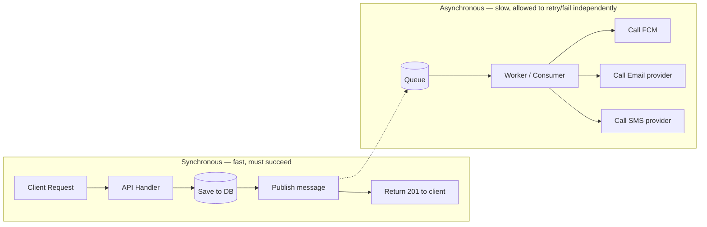

# 01 — System Overview: Why Asynchronous Processing Exists

## The naive approach (and why it breaks)

Imagine the simplest possible notification feature. A user places an order. Your API handler
does this, all inline, in one HTTP request:

```
POST /orders
  -> create order in DB
  -> send push notification (call FCM)
  -> send confirmation email (call SendGrid)
  -> send SMS (call Twilio)
  -> return 201 to client
```

This is **synchronous processing**: every step happens one after another, in the same
request/response cycle, and the client waits for all of it before getting a response.

### Why this fails in practice

1. **Latency stacks up.** If FCM takes 200ms, SendGrid takes 400ms, and Twilio takes 600ms,
   your "create an order" endpoint now takes 1.2+ seconds minimum — even though creating the
   order itself takes 10ms. The user is staring at a spinner for something that has nothing
   to do with the actual order logic.

2. **A third party's outage becomes your outage.** If Twilio is down or slow, your order
   endpoint is now down or slow. You've taken a hard dependency on a system you don't control,
   and you've done it *inline*, so its failure directly fails your core business action (the
   order). This is the single biggest reason production systems avoid synchronous fan-out to
   external services.

3. **Partial failure is ambiguous.** Say the order saves fine, the push notification sends,
   but the email call throws an exception. Do you roll back the order? Return an error to the
   client even though the order *did* get created? Retry just the email, right now, inline,
   and make the user wait even longer? There's no good answer as long as everything happens
   in one request.

4. **It doesn't scale independently.** Order creation might need to handle 500 requests/sec at
   peak. Sending SMS might only be able to sustain 20/sec because of provider rate limits.
   When they're coupled in one request handler, the slowest, most rate-limited dependency
   throttles the entire endpoint.

5. **No natural retry story.** If the SMS provider returns a transient 503, what retries it?
   Retrying inline means the client waits even longer. Not retrying means silent data loss —
   the user just never gets an SMS, with no record that it was supposed to happen.

### Real-world framing

Think about Uber: when your trip ends, you get a push notification, an email receipt, and
potentially an SMS if the app doesn't have permission for push. Uber's trip-completion
service does **not** call FCM/SendGrid/Twilio directly and wait. It writes "trip completed"
as an event, and hands off everything else to be handled independently, at its own pace, with
its own retry rules — completely decoupled from whether your ride was marked as finished.

## The fix: decouple "what happened" from "what to do about it"

The core idea is to split the flow into two independently-scalable, independently-failing
halves, connected by a durable buffer:



The API's job shrinks to: *validate, persist, publish, respond*. That's it. Everything that
is slow, external, rate-limited, or failure-prone happens **after** the client already has
their response, in a separate process, on its own schedule.

This single design decision is why words like "producer", "consumer", "queue", and "worker"
exist at all — they're just names for the two sides of this split and the buffer between
them:

- **Producer** — the part of the system that knows *something happened* (an order was
  placed) and announces it. It does not know or care who's listening, or what they'll do.
- **Queue** (a **message broker**, e.g. RabbitMQ) — a durable holding area between producer
  and consumer. It stores the message until someone is ready to process it, so the producer
  never has to wait for a consumer to be available.
- **Consumer / Worker** — a separate process that pulls messages off the queue and does the
  actual slow work (calling FCM, SendGrid, Twilio), independently of the original HTTP
  request's lifetime.

## What we get from this split

| Problem with synchronous | How async fixes it |
|---|---|
| Client waits for slow 3rd parties | Client gets a response the instant the message is queued |
| 3rd party outage takes down your API | Worker can retry/fail without affecting the API at all |
| Partial failure is ambiguous | The event (order created) already succeeded and is durable; delivery failures are handled entirely on the consumer side, with their own retry/DLQ logic (Phase 7) |
| Coupled scaling | API scales for request volume; workers scale for delivery volume — independently |
| No retry story | The message *stays in the queue* (or a retry queue) until it's successfully processed |

## What we give up (there's no free lunch)

- **Eventual consistency, not immediate confirmation.** The API returning 201 means "the
  order was saved and the notification was *queued*" — not "the user's phone buzzed." You
  will need a way to answer "did this notification actually get delivered?" later — that's
  what delivery logs are for (Phase 10).
- **Operational complexity.** You now run a message broker as a piece of infrastructure that
  can itself go down, fill up, or misbehave. This is a real cost — for a project this size it
  is worth it *because the whole point is to learn it*, but it's fair to note a truly tiny
  system might not need this yet.
- **Idempotency becomes mandatory.** A message might be delivered more than once (we'll see
  exactly why once we cover acknowledgements in Phase 2). Consumers must handle "I've already
  processed this" gracefully, or a retried push notification becomes a duplicate push
  notification.
- **Ordering is no longer free.** In a single synchronous function, "step 2 happens after
  step 1" is automatic. Across a queue, with multiple consumers, ordering has to be
  deliberately designed for (Phase 2/6).

## Where this leaves our project

Our notification service's write path will always follow this shape, regardless of channel:

```
API (validate + persist + publish) → Queue → Worker (routing, preferences, delivery) → Channel
```

Everything from here — RabbitMQ's exchanges and bindings, retry queues, dead letter queues,
FCM's token lifecycle — is really just *filling in the details* of this one diagram. Once this
split makes sense, the rest of the system is elaboration, not new ideas.

## Checkpoint

Before moving to Phase 2 (RabbitMQ fundamentals), you should be able to answer, in your own
words:

1. Why does the order-creation endpoint return a response *before* the SMS is actually sent?
2. If Twilio is completely down for an hour, what happens to order creation in our design?
   What happens to SMS delivery?
3. What's the difference between "the notification was queued" and "the notification was
   delivered"? Why do we need to track both?

## Common interview angle

"Why would you use a message queue instead of just calling the downstream service directly?"
is a very common system design interview question. The strong answer isn't "because queues
are scalable" (vague) — it's the specific failure modes above: latency coupling, availability
coupling, and lost retry semantics. Being able to name the *specific* failure a queue prevents
is what separates a memorized answer from an understood one.
