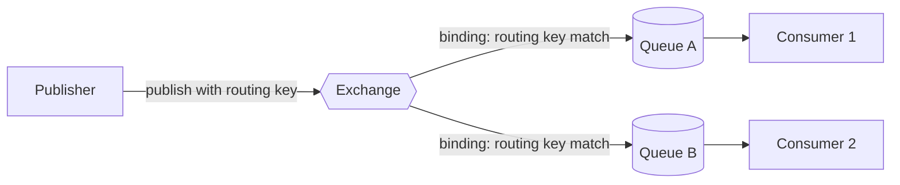
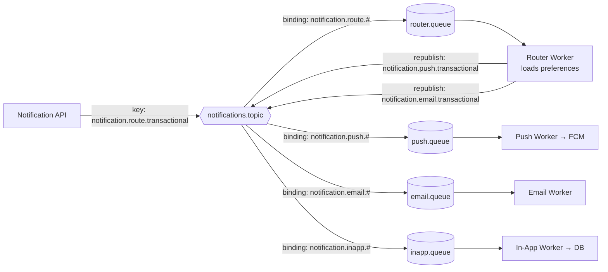
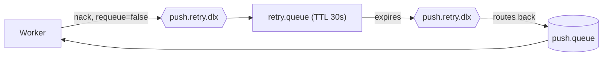

# 02 — RabbitMQ Fundamentals

Phase 1 established *why* we split work with a queue. This phase is about what actually sits
in the middle of that split — RabbitMQ — and the vocabulary needed to reason about it.

## What RabbitMQ actually is

RabbitMQ is a **message broker**: a standalone server whose only job is to accept messages
from producers, hold them durably, and hand them to consumers according to routing rules you
define. It speaks a protocol called **AMQP** (Advanced Message Queuing Protocol).

The single most important thing to unlearn: **a publisher never sends a message directly to a
queue.** It always publishes to an **exchange**. The exchange decides — based on rules you
configured — which queue(s), if any, the message ends up in. Queues are just where consumers
actually read from.



This indirection is the whole point of RabbitMQ over "just a queue": it lets one event fan
out to many destinations, or be routed to exactly one destination, purely through
configuration — without the publisher knowing anything about who's listening.

## The core vocabulary

### Exchange
A routing rule engine. Every message a publisher sends goes to an exchange first, tagged with
a **routing key** (a string like `notification.push.transactional`). The exchange type
determines how that routing key is interpreted.

### Queue
A durable, ordered buffer of messages, sitting on disk (if durable) inside RabbitMQ, waiting
for a consumer to fetch and acknowledge them. Queues don't do routing logic — they just hold
messages that were routed to them.

### Binding
The link you create between an exchange and a queue, optionally with a pattern (e.g. "route
messages whose key matches `notification.push.*` to `push.queue`"). No binding = the exchange
has nowhere to route that message, and it's dropped (or returned, depending on config).

### Routing key
A string attached to a published message, used by the exchange to decide where it goes.
Think of it as an address, not a payload — the payload is separate.

## The four exchange types

| Type | Routing behavior | When you'd use it |
|---|---|---|
| **Direct** | Exact match: routing key must equal the binding key exactly | One queue per exact category, e.g. `push` routes only to the push queue |
| **Topic** | Pattern match with wildcards: `*` = one word, `#` = zero or more words | Hierarchical routing, e.g. `notification.push.*` catches both `notification.push.transactional` and `notification.push.promotional` |
| **Fanout** | Ignores the routing key entirely — delivers to *every* bound queue | Broadcast: "user logged out everywhere" needs to hit an audit queue *and* a session-invalidation queue *and* an analytics queue, all at once |
| **Headers** | Matches on message header key/value pairs instead of the routing key | Rare in practice; useful when routing criteria aren't naturally expressible as a single string |

**How our project uses this:** we'll use a single **topic exchange** called
`notifications.topic`. Every channel gets its own queue bound with a wildcard pattern like
`notification.push.#`, so **one exchange** cleanly fans out to **channel-specific queues**
without the publisher needing to know how many channels exist or which ones are enabled for a
given user. Adding a new channel later (say, WhatsApp) means adding one new queue + one new
binding — zero changes to the publishing code. This is precisely the "add channels without
redesigning the system" requirement from the project brief, and it's *why* we picked topic
over direct.

One refinement made in Phase 8 (`08-notification-flow.md`), noted here so the queue topology
stays accurate: the API does **not** publish directly with a per-channel key like
`notification.push.transactional`. It doesn't yet know which channels are enabled for the
user — that depends on `notification_preferences`, which is a database lookup, not something
the API should block on before responding. So the API publishes once, per notification, with
a routing key like `notification.route.transactional`, which lands in a dedicated
**`router.queue`**. A **router worker** consumes that queue, loads preferences, and
*republishes* one message per enabled channel using the `notification.<channel>.<category>`
key shape shown below — which the existing channel bindings pick up unchanged.



## Publisher and consumer, precisely

- **Publisher** — opens a channel (a lightweight connection to RabbitMQ), publishes a message
  with a routing key to an exchange, and moves on. It gets no confirmation that anyone
  consumed it — only (optionally) that the broker *accepted* it.
- **Consumer** — subscribes to a queue and receives messages one at a time (or in small
  batches, see prefetch below). Critically, a consumer must explicitly **acknowledge** each
  message once it's done processing it.

## Acknowledgement: ack, nack, requeue

This is the mechanism that makes queues *reliable* rather than just "fire and forget."

- **Ack (acknowledge)** — the consumer tells RabbitMQ "I successfully processed this message,
  you can delete it." Until this happens, RabbitMQ keeps the message.
- **Nack (negative acknowledge)** — the consumer tells RabbitMQ "this failed." Nack takes a
  flag for whether to **requeue**:
  - `nack(requeue=true)` — put it back on the queue immediately, another (or the same)
    consumer will get it again. Useful for transient failures.
  - `nack(requeue=false)` — don't requeue; instead route it to a **dead letter exchange** if
    one is configured (see below).
- **What if a consumer just crashes** without ack or nack? RabbitMQ notices the connection
  drop and automatically requeues the message — this is what makes the system fault-tolerant
  to worker crashes: a message is never silently lost just because the process handling it
  died mid-way.

This is also *why* idempotency (mentioned in Phase 1) is mandatory: if a worker finishes
sending a push notification but crashes *before* sending the ack, RabbitMQ will redeliver that
same message to another worker, which will send the push **again**. The queue guarantees
"at-least-once delivery," never "exactly-once" — your consumer logic has to tolerate
duplicates (we'll implement this concretely in Phase 6 using a delivery-log check).

## Prefetch (QoS)

By default, RabbitMQ will push messages to a consumer as fast as it can, queuing them up
client-side. If your worker is slow, this means one worker hoards hundreds of messages it
hasn't even started processing yet, while other idle workers starve.

**Prefetch** (`channel.prefetch(n)`) caps how many *unacknowledged* messages a consumer can
hold at once. Set it to 1, and RabbitMQ won't hand the consumer a second message until the
first is ack'd/nack'd — this is what makes horizontal scaling of workers actually work: spin
up 5 worker instances with prefetch=1 each, and RabbitMQ load-balances messages across them
one at a time, based on who's actually free.

## Retry, without a native retry feature

RabbitMQ has no built-in "retry after 30 seconds" button. The standard pattern combines two
primitives you already have:

1. **Message TTL (time-to-live)** on a queue — a message sitting in that queue expires after
   N milliseconds.
2. **Dead Letter Exchange (DLX)** — every queue can be configured with a DLX: when a message
   is nack'd (without requeue) *or* expires from TTL, instead of vanishing, it gets
   re-published to the DLX.

Chain these together and you get a **delay queue**: a queue with a short TTL and a DLX
pointing back at your real work queue. A failed message gets nack'd → routed to
`retry.queue` (TTL 30s) → expires → dead-lettered back into `push.queue` → consumed again.
Repeat with increasing TTLs (30s, 2min, 10min) for exponential backoff. We'll build this
concretely in Phase 7.



## Dead Letter Queue and poison messages

A **poison message** is one that will *never* succeed no matter how many times you retry it —
e.g. the payload is malformed JSON, or it references a user ID that no longer exists. Without
a limit, the retry loop above would cycle this message forever, burning worker capacity on
something guaranteed to fail.

The fix: track a retry count (usually a header incremented each cycle), and once it exceeds a
max (e.g. 5), route the message to a genuine **Dead Letter Queue** — a queue nothing consumes
automatically. It sits there for a human (or an alerting job) to inspect. This is your safety
net against both bad data and bugs in worker code: nothing is silently dropped, and nothing
loops forever.

## Recap: how every concept maps onto our project

| Concept | Our usage |
|---|---|
| Exchange | One topic exchange: `notifications.topic` |
| Routing key | `notification.route.<category>` from the API; `notification.<channel>.<category>` when the router republishes |
| Binding | `notification.route.#` → `router.queue`; one binding per channel queue using `notification.<channel>.#` |
| Queue | `router.queue`, plus one queue per channel: `push.queue`, `email.queue`, `inapp.queue`, etc. |
| Publisher | The Notification API (publishes once to `router.queue`); the router worker (republishes per enabled channel) |
| Consumer | The router worker, plus one NestJS microservice per channel (push worker, email worker, ...) |
| Prefetch | Set to 1 per worker instance so RabbitMQ load-balances fairly |
| Ack/Nack | Ack after successful delivery + logging; nack (no requeue) on failure |
| Retry / DLX | `retry.queue` with TTL, dead-lettering back to the channel queue, capped by a retry-count header |
| Dead Letter Queue | `failed.queue` — final resting place after max retries, for manual/alerted inspection |

## Hands-on: see it, don't just read it

Before we touch NestJS, get RabbitMQ running locally and *look* at these concepts in the
management UI — this will make everything above concrete instead of abstract.

```bash
docker run -d --name rabbitmq -p 5672:5672 -p 15672:15672 rabbitmq:3-management
```

Then open **http://localhost:15672** (default login `guest` / `guest`). In the UI:
1. Go to **Exchanges** → create one named `notifications.topic`, type `topic`.
2. Go to **Queues** → create `push.queue`.
3. Bind them: on the `notifications.topic` exchange page, add a binding to `push.queue` with
   routing key `notification.push.#`.
4. Use the exchange's "Publish message" panel to publish a test message with routing key
   `notification.push.transactional` and confirm it lands in `push.queue` (check the queue's
   "Get messages" panel).
5. Try publishing with routing key `notification.email.transactional` and confirm it does
   **not** land in `push.queue` — this proves the topic-routing wildcard is doing real work.

## Checkpoint

1. Why does a publisher send to an *exchange* rather than directly to a queue?
2. If a worker crashes halfway through processing a message, what does RabbitMQ do, and why
   does that make duplicate-delivery handling mandatory in your worker code?
3. Why can't you just set a queue's TTL to implement retries without also configuring a DLX?
4. What's the difference between the retry queue and the dead letter queue in our design —
   why do we need both?

## Common interview angle

"How would you implement delayed retries in RabbitMQ?" tests whether you understand that
RabbitMQ has no native delay/retry primitive — the expected answer is the TTL + DLX pattern
above, plus a capped retry counter to avoid infinite loops (which is also what separates a
retry queue from a dead letter queue).
