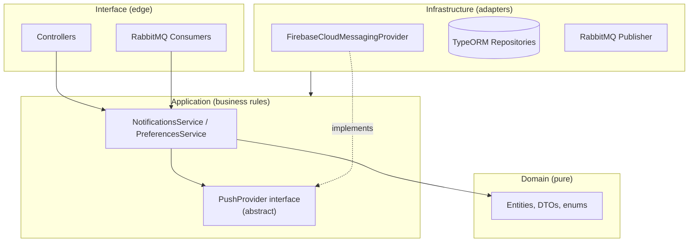
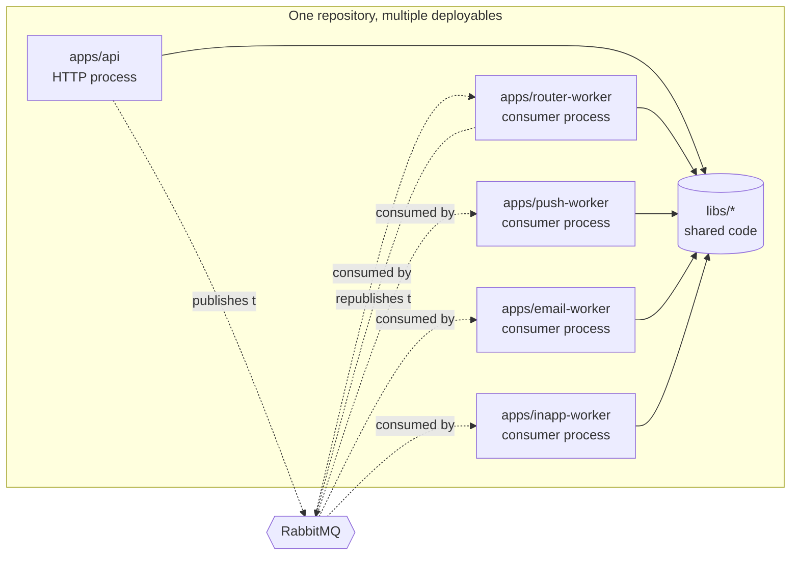

# 03 — Project Architecture: Structuring a NestJS Service That Won't Collapse Under Its Own Weight

Phases 1 and 2 established *what* our system does (decouple write path from delivery via
RabbitMQ) and *how* messages move through it. This phase is about *where the code for all of
that actually lives* — and why the answer isn't "one NestJS app with a bunch of folders in
`src/`."

## Why architecture is a real decision here, not busywork

Imagine we skip this and just start writing code: a `NotificationsController`, a
`NotificationsService` that validates input, saves to Postgres, calls the Firebase Admin SDK
directly, formats an email string, and publishes to RabbitMQ — all in one file, because it's
faster to get something working today.

Here's what breaks as the project grows past channel #1:

1. **Adding a channel means editing existing code, not adding new code.** Want WhatsApp?
   Now you're back inside `NotificationsService`, adding an `if (channel === 'whatsapp')`
   branch next to the push and email branches. Every new channel raises the odds you break an
   existing one — the opposite of what Phase 2's topic-exchange design was supposed to buy us.
2. **You can't test business logic without a live Firebase connection.** If "decide whether
   this notification should be sent" and "actually call the FCM SDK" are the same function,
   every unit test for the decision logic requires mocking (or worse, actually hitting) an
   external service.
3. **You can't swap providers later.** Say FCM changes its pricing or you want to add a second
   push provider for redundancy. If `FirebaseAdmin.send(...)` calls are scattered across
   controllers and services, "swap the push provider" becomes a project-wide grep-and-replace
   instead of writing one new class.
4. **You can't deploy or scale pieces independently.** If the HTTP API and the queue consumers
   are the same running process, you cannot scale "handle more incoming HTTP requests" and
   "process more queued push notifications" separately — even though Phase 1 explicitly
   designed for that separation.

None of this is about following rules for their own sake. Every principle below exists to
prevent one of these four specific failures.

## Clean Architecture, the pragmatic subset

"Clean Architecture" (Uncle Bob) is usually drawn as four concentric rings — Entities, Use
Cases, Interface Adapters, Frameworks & Drivers — with a single rule: **dependencies point
inward.** Outer layers (HTTP controllers, database drivers, the Firebase SDK) may depend on
inner layers (business rules), but never the reverse. The inner layers don't know NestJS,
Postgres, or Firebase exist.

We are **not** building a strict four-ring hexagon with a `port` interface in front of every
single class — for a project this size that's ceremony without payoff (a repository interface
in front of a `users` table that will only ever be Postgres, forever, buys you nothing but
extra files to navigate). We adopt the rule where it actually earns its keep:

| Layer (our version) | Contains | Depends on | Knows about NestJS/Postgres/FCM? |
|---|---|---|---|
| **Domain** | Entities/types, enums, DTOs (e.g. `NotificationCategory`, `SendPushCommand`) | Nothing | No |
| **Application** | Services holding business rules ("should this notification be sent given preferences?", "build the routing key") | Domain + abstractions (interfaces) | No — talks to `PushProvider`, not `admin.messaging()` |
| **Infrastructure** | Concrete adapters: `FirebaseCloudMessagingProvider`, TypeORM entities/repositories, RabbitMQ publisher | Application's interfaces | Yes — this is where the framework/SDK calls actually live |
| **Interface (delivery)** | Controllers (HTTP), consumers (RabbitMQ message handlers) | Application services | Yes — this is the NestJS-facing edge |

**Where we stop:** we do not add a layer just because Clean Architecture diagrams show one.
Concretely:
- DTOs and entities can be the same class in simple cases (a `NotificationTemplate` domain
  type and its TypeORM entity can be one file) — splitting them only pays off once they
  actually diverge.
- We don't wrap every third-party call in an interface "just in case" — only where we have a
  concrete, named reason to expect a swap (FCM is the clear case: Phase 8 already
  anticipates other push providers; a UUID generator is not).
- Controllers stay thin (validate input via DTO, call one service method, return) — that part
  of Clean Architecture *does* earn its keep immediately, because it's what keeps business
  logic testable without spinning up HTTP.



Note the arrow direction: `FirebaseCloudMessagingProvider` (infrastructure) implements the
`PushProvider` interface that `Application` defines and depends on — infrastructure depends on
application, never the reverse. This is what the "dependency rule" buys us concretely: the
application layer's import list never contains `firebase-admin`.

## SOLID, applied to this project (not as trivia)

| Principle | Violated version (what we're avoiding) | Applied here |
|---|---|---|
| **S**ingle Responsibility | One `NotificationsService` validates, persists, formats messages per channel, *and* calls FCM directly | `NotificationsService` (decides *what* + persists) is separate from `PushDeliveryService`/`FcmProvider` (decides *how* to actually deliver). Each has exactly one reason to change. |
| **O**pen/Closed | Adding WhatsApp requires editing an `if/else` chain inside existing delivery code | Adding WhatsApp means: new `whatsapp.queue` binding (Phase 2), new `WhatsappModule` + `WhatsappProvider` implementing the same interface, new consumer app. Zero lines changed in existing modules. |
| **L**iskov Substitution | A `PushProvider` and an `EmailProvider` share a base class but one throws on a method the other doesn't support | Every channel provider implements the *same shape* of contract — `send(notification): Promise<DeliveryResult>` — so a worker can call `provider.send(...)` without knowing or caring which concrete provider it holds. |
| **I**nterface Segregation | One giant `NotificationProvider` interface with methods for push tokens, email templates, SMS opt-outs, all forced on every implementer | Small, channel-specific interfaces (`PushProvider`, `EmailProvider`) — a push provider is never forced to implement `renderHtmlTemplate()`. |
| **D**ependency Inversion | `NotificationsService` does `new FirebaseAdmin()` and calls it inline | `NotificationsService`/workers depend on the `PushProvider` **interface**, injected by NestJS's DI container. The concrete `FcmProvider` is bound to that token in a module — swappable, and mockable in tests without touching Firebase at all. |

The DIP row is the one worth dwelling on, because it's the direct mechanical reason "swap FCM
later" and "unit test without a real Firebase project" are both possible: as long as
`PushProvider` is an abstract token (an interface + a NestJS provider binding), the *consumer*
of that token never needs to change when the binding changes.

```typescript
// domain/interfaces/push-provider.interface.ts — no framework, no SDK imports
export interface PushProvider {
  send(token: string, payload: PushPayload): Promise<DeliveryResult>;
}

// infrastructure/fcm/fcm.provider.ts — the only place firebase-admin is imported
@Injectable()
export class FcmProvider implements PushProvider {
  async send(token: string, payload: PushPayload): Promise<DeliveryResult> {
    /* admin.messaging().send(...) lives here, nowhere else */
  }
}

// push-worker module wiring — this one line is the entire "swap point"
providers: [{ provide: 'PUSH_PROVIDER', useClass: FcmProvider }]
```

If we later add a second push vendor for failover, we write one new class implementing
`PushProvider` and change one line of module wiring — nothing that calls `send()` changes.

## Dependency Injection, and why it matters more than "it's a NestJS feature"

NestJS's DI container is often introduced as "how you get a service into a constructor," which
undersells it. What it actually gives us:

- **Swappability without touching call sites** (shown above) — this is the DIP payoff made
  concrete.
- **Testability** — a unit test for `NotificationsService` can provide a fake `PushProvider`
  (`{ send: jest.fn().mockResolvedValue(...) }`) instead of a real FCM connection. Without DI,
  "fake the dependency" means monkey-patching a module import, which is fragile.
- **Lifecycle management** — NestJS controls whether a provider is a singleton, request-scoped,
  or transient. We don't hand-write connection pooling for the RabbitMQ channel or the Postgres
  pool; we register them once as providers and inject them wherever needed.

## Modular structure: feature modules + shared/core modules

Every distinct *domain concern* gets its own NestJS module, each exposing a narrow public API
via its exported providers:

- **Feature modules** (one per bounded concern): `AuthModule`, `UsersModule`,
  `NotificationsModule`, `DeviceTokensModule`, `PreferencesModule`, `TemplatesModule`, and one
  per channel: `PushModule`, `EmailModule`, `InAppModule` (SMS/WhatsApp modules exist as
  placeholders per the roadmap, matching the future queues from Phase 2).
- **Shared/core modules** (imported by many feature modules, contain no business rules of
  their own): `DatabaseModule` (TypeORM/Prisma connection), `MessagingModule` (RabbitMQ
  connection + exchange/queue topology + a typed `publish()` helper), `ConfigModule` (validated
  env access), `LoggerModule` (structured logger).

The rule of thumb: if two feature modules need the same *infrastructure*, it belongs in a
shared module. If they need the same *business rule*, that's usually a sign the boundary is
drawn wrong (e.g. "which channels is this user opted into" belongs in `PreferencesModule`,
not copy-pasted into `PushModule` and `EmailModule`).

## Configuration via environment variables

Nothing environment-specific — DB connection strings, RabbitMQ URL, FCM service account
credentials, JWT secret, retry TTLs/max-attempts — is hardcoded. This isn't just 12-factor-app
box-ticking; it's what makes the *same* built code deployable to local Docker Compose, a CI
test run, and production without a code change, and it's what keeps FCM service account keys
and DB passwords out of source control.

We wrap `@nestjs/config` with a validation schema (e.g. `zod` or `joi`) that runs at process
boot, not at first use:

```typescript
const configSchema = z.object({
  DATABASE_URL: z.string().url(),
  RABBITMQ_URL: z.string().url(),
  FCM_PROJECT_ID: z.string().min(1),
  FCM_CLIENT_EMAIL: z.string().email(),
  FCM_PRIVATE_KEY: z.string().min(1),
  JWT_SECRET: z.string().min(16),
  RETRY_MAX_ATTEMPTS: z.coerce.number().default(5),
});
```

Why validate at boot rather than let a missing var blow up wherever it's first read? Because
"the push worker crashes 20 minutes into processing a backlog because `FCM_PRIVATE_KEY` was
never set" is a far worse failure than "the process refuses to start at all, with one clear
error line, at 9am during deploy."

## Logging approach

Two things matter more than log *volume*: structure and correlation.

- **Structured (JSON) logs**, not free-text strings — so logs are queryable ("show me every
  log line for `notification_id = X`") instead of grep'd.
- **A correlation ID that survives the queue hop.** An HTTP request has a natural request ID,
  but that ID is meaningless once a message crosses into RabbitMQ and gets picked up by a
  worker process minutes later. We carry the `notification_id` (and a `message_id` for the
  specific queue message) as a field on *every* log line touching that unit of work — in the
  API when it's published, and in the worker when it's consumed, retried, or dead-lettered.
  This is what makes "trace one notification's full journey across two separate processes"
  possible at all; without a shared ID, the API's logs and the worker's logs are two unrelated
  streams that happen to run near each other in time.
- **Log level discipline**: `debug` for payload contents (noisy, dev-only), `info` for
  lifecycle events (published, consumed, delivered), `warn` for retries, `error` for
  dead-lettered messages and provider failures — because "everything is `console.log`" makes it
  impossible to turn down noise in production without losing signal.

## Why the producer API and channel workers must be separate deployable processes

This is the architectural decision Phase 1 already implied but didn't spell out: **the HTTP API
and the queue consumers should never be the same running process**, even though a lot of their
code (entities, DTOs, the `MessagingModule`) is identical.

Why not just run everything in one `main.ts` — an HTTP server that *also* starts RabbitMQ
consumers on boot? Because that silently reintroduces the coupling Phase 1 spent its whole
argument removing:

| If API + workers are one process | If they're separate processes |
|---|---|
| A memory leak or crash in the *push worker* (e.g. a bad FCM response causing an unhandled rejection) takes down the *HTTP API* too — an unrelated feature (device token registration) goes down because of a push delivery bug. | Worker crash restarts the worker container; the API keeps serving requests the whole time. |
| Scaling for "more incoming signup traffic" and "bigger push notification backlog" are the same knob — you scale both or neither. | `docker-compose up --scale push-worker=5` scales *only* the bottleneck, leaving the API at 1 replica. |
| A deploy of a one-line email template fix redeploys (and risks) the entire HTTP API. | Deploying the email worker touches nothing the API depends on. |
| CPU/connection budgeting is shared and unpredictable — a burst of queue messages competes with HTTP request handling for the same event loop. | Each process has its own resource budget, tuned to its own workload (workers: prefetch + concurrency; API: request concurrency). |

## Why four apps specifically — and is that actually necessary?

The table above justifies splitting *API* from *workers*. It doesn't yet justify the next
question: why does each **channel** get its own worker app (`router-worker`, `push-worker`,
`inapp-worker`, and eventually `email-worker`) instead of one `workers` app that starts three
consumers — one per queue — inside a single process?

**Honest answer: no, it is not strictly necessary.** Nothing about RabbitMQ, NestJS, or this
project's correctness requires one process per channel. A single `apps/workers/main.ts` that
calls `messagingService.consume()` three times (once for `router.queue`, once for `push.queue`,
once for `inapp.queue`) would work identically for everything we tested in the smoke test —
same topology, same retry/DLQ behavior, same delivery logs. In fact, for this project's actual
traffic (a handful of test notifications), the four-process split is more operational overhead
than the workload justifies today.

So why build it this way anyway? Two reasons, both about what happens *if this had to scale or
harden in a way this project's traffic never actually forces it to*:

1. **Per-channel failure isolation, not just API-vs-worker isolation.** If `push-worker` and
   `inapp-worker` shared one process and a bug in the FCM integration (say, a malformed
   credential causing repeated unhandled rejections) crashed that process, in-app delivery — a
   completely unrelated channel — would go down with it, even though nothing about in-app
   delivery was broken. Splitting by channel means a push-specific bug can only ever take down
   push delivery.
2. **Per-channel scaling, not just API-vs-worker scaling.** Push volume and in-app volume don't
   necessarily move together — a promotional push campaign can spike push traffic 50x while
   in-app volume stays flat. `docker compose up --scale push-worker=5` (or the equivalent
   Kubernetes replica count) lets you add capacity exactly where the bottleneck is. One shared
   `workers` process would force you to scale all three consumers together even though only one
   of them is actually behind.

Both of these are genuinely *production* concerns — they matter at a traffic and reliability
bar this learning project doesn't actually operate at. The four-app split is here because it's
the shape a real system takes once those concerns become real, and building it now means the
architecture doesn't need a rewrite later — not because four processes were required to make
today's smoke test pass. If you were optimizing purely for "least moving parts for a project
this size," collapsing all three consumers into one `apps/workers` process would be a completely
reasonable simplification, and you'd lose only the two properties above, not correctness.

**Recommendation: a NestJS monorepo using `apps/`,** not one app or N unrelated repos. NestJS's
CLI natively supports multiple `apps/*` entry points sharing `libs/*` code, compiled and run
independently but versioned and reviewed together. This gets us both things at once: genuine
process isolation in production, and zero code duplication between "the entity for a
notification row" used by the API and the same entity used by a worker.



A single monolith process was the *alternative we rejected*, for the same reason Phase 1
rejected calling FCM/SendGrid/Twilio inline from the order handler — it re-couples things that
fail, scale, and deploy on different schedules.

## Annotated folder tree

```
fcm-notifications/
├── apps/
│   ├── api/                        # The producer: HTTP only. Validates, persists, publishes. Never calls FCM/SMTP directly.
│   │   └── src/
│   │       ├── auth/                # AuthModule — signup/login, JWT issuance (intentionally minimal; not the focus)
│   │       ├── users/                # UsersModule — user CRUD backing auth + admin lookups
│   │       ├── device-tokens/        # DeviceTokensModule — register/list/revoke FCM tokens
│   │       ├── notifications/        # NotificationsModule — create/list/read notifications, publish to RabbitMQ
│   │       ├── preferences/          # PreferencesModule — per-channel/category opt-in/out
│   │       ├── templates/            # TemplatesModule — notification_templates CRUD (admin)
│   │       ├── admin/                # AdminModule — send/send-bulk/broadcast endpoints, role-guarded
│   │       └── main.ts               # HTTP bootstrap only — no consumers registered here
│   ├── router-worker/                # Consumer process: router.queue → reads notification_preferences, republishes per enabled channel. No external provider call.
│   ├── push-worker/                 # Consumer process: push.queue → FCM. Own main.ts, own scaling knob.
│   ├── email-worker/                 # Consumer process: email.queue → (future) email provider. Placeholder for now.
│   ├── inapp-worker/                  # Consumer process: inapp.queue → writes delivery row, no external call needed
│   └── sms-worker/, whatsapp-worker/  # Placeholders — exist only once those channels are actually built (Phase 9+)
├── libs/
│   ├── database/                    # TypeORM/Prisma entities + migrations — the one source of truth for schema, shared by every app
│   ├── messaging/                    # RabbitMQ connection setup, exchange/queue/binding declarations, typed publish() helper, retry/DLX wiring
│   ├── domain/                       # Framework-free types: enums (channel, category, status), DTOs, the PushProvider/EmailProvider interfaces
│   ├── providers/                    # Concrete channel adapters: FcmProvider, (future) SendGridProvider — the DIP "swap points"
│   └── common/                       # Cross-cutting: structured logger, config validation schema, auth guards, exception filters
├── docs/                             # This documentation series — one phase, one file, in order
├── docker-compose.yml                 # Local Postgres + RabbitMQ (management UI) + all apps, for one-command local spin-up
├── nest-cli.json                     # Declares the apps/libs monorepo layout to the Nest CLI
├── package.json                       # Single dependency tree shared by all apps (simplifies versioning across the monorepo)
└── tsconfig.json / tsconfig.build.json # Path aliases so apps import libs as @app/database, @app/messaging, etc.
```

Every top-level folder above earns its place by answering "what breaks if this weren't
separate": merge `apps/*` into one app and process isolation disappears; merge `libs/*` into
each app and every entity/DTO gets duplicated (and inevitably drifts) across five codebases.

## Checkpoint

1. Why do we not wrap every single class (e.g. a UUID generator) behind an interface, even
   though Clean Architecture's diagrams technically allow it?
2. Concretely, what NestJS wiring change is required to swap `FcmProvider` for a different push
   vendor, and what does *not* need to change?
3. If the API and the push worker ran in the same process, and the push worker's FCM call threw
   an unhandled exception, what would that do to unrelated API traffic (e.g. login requests)?
4. Why does `libs/domain` explicitly forbid importing NestJS decorators or the Firebase SDK?

## Common interview angle

"How would you structure a Node/NestJS service so it's testable and providers are swappable?"
is really asking whether you understand Dependency Inversion as a mechanical practice, not a
buzzword — the strong answer names the specific interface (`PushProvider`), the specific
binding point (module `providers: [{ provide, useClass }]`), and the specific test benefit
(inject a fake in unit tests without touching the real SDK). A second common follow-up —
"why would you split a monolith into an API and separate workers if they share 90% of their
code?" — is answered by naming the specific coupling being removed: crash isolation,
independent scaling, and independent deploys, not "microservices are more scalable" as a vague
slogan.
