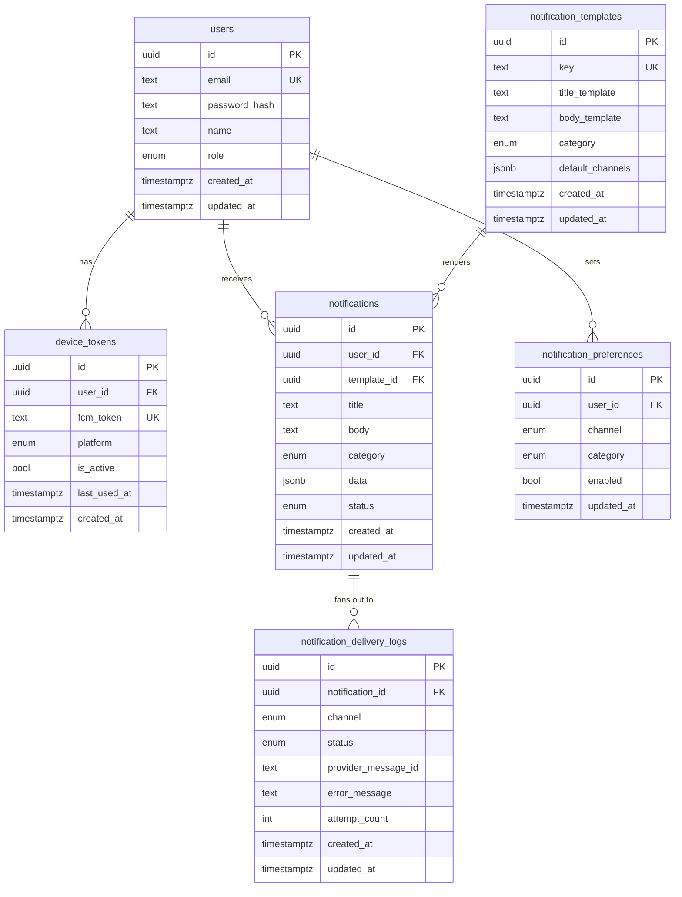

# 04 — Database Design: Modeling Notifications, Preferences, Tokens, and Delivery History

Phase 3 decided *where the code lives*. This phase decides *what the data looks like* — the
schema every app in `apps/*` (API and every channel worker) reads and writes against, via the
shared `libs/database` entities.

## What this schema has to answer

Before looking at a single table, it's worth being explicit about the questions the schema
must be able to answer, because every table below exists to answer one of these:

1. Who is this user, and how do we authenticate them? → `users`
2. Which devices can we actually push to, and are those tokens still valid? → `device_tokens`
3. What does a given kind of notification *look like* (title/body/default channels), without
   hardcoding strings all over the app? → `notification_templates`
4. Which channels/categories has this user opted into or out of? → `notification_preferences`
5. What notification *conceptually happened*, regardless of how many channels it went out on? →
   `notifications`
6. For a given notification, what happened on *each individual channel attempt* — sent?
   retried? dead-lettered? → `notification_delivery_logs`
7. (Debug/optional) What actually moved through RabbitMQ, for when something looks wrong and we
   need to inspect the broker-level trail? → `queue_logs`

## Why UUID primary keys, everywhere

Every table uses a UUID primary key instead of an auto-incrementing integer. Three concrete
reasons, not just "UUIDs are modern":

1. **Generated before the insert, not after.** The API needs a notification's ID at the moment
   it publishes the RabbitMQ message — *before* it can know what a database-assigned
   auto-increment value would be (that only exists after the `INSERT` returns). With UUIDs, the
   producer generates the ID client-side, persists the row, and publishes a message carrying
   that same ID in one straight line, no "insert, then re-read the ID, then publish" round trip.
2. **No cross-service coordination needed.** Once workers (Phase 3) run as independent
   processes, and eventually the DB itself might be sharded/partitioned (see scalability
   below), auto-increment integers require a single authority to hand out the next number.
   UUIDs are generated independently by any process with zero coordination and (practically)
   zero collision risk.
3. **Don't leak business information.** A sequential `id=1042` on a `notifications` row leaks
   "how many notifications have ever been sent" to anyone who can see an ID (e.g. in a URL like
   `GET /notifications/1042`) and makes IDs guessable/enumerable. A UUID leaks nothing.

The tradeoff we accept: UUIDs are 16 bytes vs 4/8 for integers, and as a primary key they can
fragment B-tree index pages more than a monotonic key (this matters at very large scale — see
the partitioning note at the end). For this project's scale, that cost is worth the three
benefits above; at extreme scale, teams often switch to ULIDs/UUIDv7 specifically to get back
some of that monotonic-insert locality while keeping decentralized generation — worth knowing
as a "what would you do differently at 100x scale" answer, not something we need here.

## The tables

### `users`

The identity backing everything else — who owns device tokens, preferences, and notifications.

```sql
CREATE TYPE user_role AS ENUM ('user', 'admin');

CREATE TABLE users (
  id            UUID PRIMARY KEY DEFAULT gen_random_uuid(),
  email         TEXT NOT NULL UNIQUE,
  password_hash TEXT NOT NULL,
  name          TEXT NOT NULL,
  role          user_role NOT NULL DEFAULT 'user',
  created_at    TIMESTAMPTZ NOT NULL DEFAULT now(),
  updated_at    TIMESTAMPTZ NOT NULL DEFAULT now()
);
```

`role` exists purely to gate the admin endpoints (`/admin/notifications/*`) — this project's
auth is intentionally minimal (per `api-design.md`), so we keep this to the smallest thing that
lets an authorization guard ask "is this user an admin?"

### `device_tokens`

A user can have multiple devices (phone + web browser + tablet); each device registers its own
FCM token independently of the others.

```sql
CREATE TYPE device_platform AS ENUM ('ios', 'android', 'web');

CREATE TABLE device_tokens (
  id           UUID PRIMARY KEY DEFAULT gen_random_uuid(),
  user_id      UUID NOT NULL REFERENCES users(id) ON DELETE CASCADE,
  fcm_token    TEXT NOT NULL UNIQUE,
  platform     device_platform NOT NULL,
  is_active    BOOLEAN NOT NULL DEFAULT true,
  last_used_at TIMESTAMPTZ,
  created_at   TIMESTAMPTZ NOT NULL DEFAULT now()
);
```

- `fcm_token` is unique **globally**, not per-user — FCM tokens are tied to a specific
  app-install, so the same token can never legitimately belong to two different user rows. A
  duplicate insert attempt is a real signal (e.g. a user logged out and a different account
  logged in on the same device without the old token being invalidated first).
- `is_active` matters because FCM tokens go stale (app uninstalled, token rotated by the OS).
  The push worker sets this to `false` when FCM responds with an "unregistered token" error,
  instead of deleting the row outright — keeping the history of "this device used to be valid"
  without continuing to send to it.

### `notification_templates`

Lets the same "kind" of notification (e.g. `order.shipped`) be triggered from many places in
the codebase (or by other services later) without duplicating title/body copy or re-deciding
which channels it goes out on each time.

```sql
CREATE TYPE notification_category AS ENUM ('transactional', 'promotional');

CREATE TABLE notification_templates (
  id               UUID PRIMARY KEY DEFAULT gen_random_uuid(),
  key              TEXT NOT NULL UNIQUE,          -- e.g. 'order.shipped'
  title_template   TEXT NOT NULL,                  -- e.g. 'Your order has shipped!'
  body_template    TEXT NOT NULL,                  -- e.g. 'Order #{{orderId}} is on its way.'
  category         notification_category NOT NULL,
  default_channels JSONB NOT NULL DEFAULT '[]',    -- e.g. '["push", "email"]'
  created_at       TIMESTAMPTZ NOT NULL DEFAULT now(),
  updated_at       TIMESTAMPTZ NOT NULL DEFAULT now()
);
```

`key` is what calling code references (`notificationsService.sendFromTemplate('order.shipped',
{ orderId })`) instead of hardcoding title/body strings at every call site — the same reason
web apps use i18n keys instead of inline strings. `default_channels` gives a starting point
that per-user `notification_preferences` can then override.

### `notification_preferences`

Per-user, per-channel, per-category opt-in/opt-out — this is what makes a topic-exchange fan-out
(Phase 2) actually *respect the user* instead of blasting every channel regardless of consent.

```sql
CREATE TYPE notification_channel AS ENUM ('push', 'email', 'sms', 'inapp', 'whatsapp');

CREATE TABLE notification_preferences (
  id         UUID PRIMARY KEY DEFAULT gen_random_uuid(),
  user_id    UUID NOT NULL REFERENCES users(id) ON DELETE CASCADE,
  channel    notification_channel NOT NULL,
  category   notification_category NOT NULL,
  enabled    BOOLEAN NOT NULL DEFAULT true,
  updated_at TIMESTAMPTZ NOT NULL DEFAULT now(),
  CONSTRAINT uq_preference_scope UNIQUE (user_id, channel, category)
);
```

The composite unique constraint on `(user_id, channel, category)` is the whole point of this
table's shape: it guarantees at most one row answers "does this user want *promotional* *push*
notifications" — no ambiguity from duplicate/conflicting rows, and it lets application code use
a single `UPSERT` (`ON CONFLICT (user_id, channel, category) DO UPDATE`) from `PATCH
/preferences` instead of "find existing row or create" logic.

### `notifications`

The conceptual notification — "what happened," independent of how many channels it fans out to
or whether each one individually succeeded.

```sql
CREATE TYPE notification_status AS ENUM ('pending', 'queued', 'processing', 'sent', 'failed');

CREATE TABLE notifications (
  id          UUID PRIMARY KEY DEFAULT gen_random_uuid(),
  user_id     UUID REFERENCES users(id) ON DELETE SET NULL,       -- nullable: in-progress broadcast rows
  template_id UUID REFERENCES notification_templates(id) ON DELETE SET NULL,
  title       TEXT NOT NULL,
  body        TEXT NOT NULL,
  category    notification_category NOT NULL,
  data        JSONB NOT NULL DEFAULT '{}',                         -- arbitrary payload, e.g. { orderId, deepLink }
  status      notification_status NOT NULL DEFAULT 'pending',
  created_at  TIMESTAMPTZ NOT NULL DEFAULT now(),
  updated_at  TIMESTAMPTZ NOT NULL DEFAULT now()
);
```

- `user_id` is nullable specifically for `POST /admin/notifications/broadcast`: a broadcast is
  conceptually "one notification event" fanning out to every user, so it's modeled as a set of
  per-user `notifications` rows created as the broadcast job expands (or, depending on final
  design, a template-level broadcast record — either way, the column must tolerate "not yet
  resolved to one user" during that expansion).
- `status` tracks the *notification's* lifecycle (has it even been queued yet?), which is a
  different question from *delivery* status — see the next table for why that distinction is
  load-bearing, not redundant.
- `data` is JSONB rather than a fixed set of columns because every notification kind needs a
  different payload shape (an order-shipped notification needs an order ID and tracking link; a
  friend-request notification needs a different user's ID) — modeling this as rigid columns
  would mean a schema migration for every new notification kind.

### `notification_delivery_logs`

One row per **channel attempt**, not per notification — this is the most important modeling
decision in the whole schema, so it's worth explaining directly.

```sql
CREATE TYPE delivery_status AS ENUM ('queued', 'sent', 'delivered', 'failed', 'retrying', 'dead_lettered');

CREATE TABLE notification_delivery_logs (
  id                  UUID PRIMARY KEY DEFAULT gen_random_uuid(),
  notification_id     UUID NOT NULL REFERENCES notifications(id) ON DELETE CASCADE,
  channel             notification_channel NOT NULL,
  status              delivery_status NOT NULL DEFAULT 'queued',
  provider_message_id TEXT,             -- e.g. the FCM message ID returned on success
  error_message       TEXT,             -- populated on failure, for debugging without re-reading queue_logs
  attempt_count       INT NOT NULL DEFAULT 0,
  created_at          TIMESTAMPTZ NOT NULL DEFAULT now(),
  updated_at          TIMESTAMPTZ NOT NULL DEFAULT now()
);
```

#### Why this is a separate table, not extra columns on `notifications`

A single notification with `default_channels = ["push", "email"]` (or preferences overriding
that) fans out to **two independent delivery attempts** — one per channel — each with its own
success/failure/retry history. If we tried to track this with columns on `notifications`
itself (`push_status`, `email_status`, `push_attempt_count`, `email_attempt_count`, ...), the
table would need a new pair of columns for every channel we ever add (violating the same
Open/Closed principle from Phase 3 — adding WhatsApp shouldn't require an `ALTER TABLE` on the
core notifications table), and "how many times has the *push* delivery been retried" vs "how
many times has the *email* delivery been retried" would already be two different numbers living
awkwardly side by side.

Modeling it as its own table with a `notification_id` foreign key means:
- **One notification → N delivery log rows**, one per channel it actually went out on — a
  natural one-to-many, not a wide table.
- **Each row's `status`/`attempt_count` is independently updatable** as that specific channel's
  worker (Phase 3's `push-worker`, `email-worker`, ...) processes retries — a push retry and an
  email retry never contend on the same row or need to know about each other.
- **Adding a channel is zero schema change** — the new channel's worker just starts inserting
  rows with `channel = 'whatsapp'`; `notification_delivery_logs` doesn't change shape.
- It directly answers the Phase 1 question "did this notification actually get delivered?" —
  per channel, with a full retry trail, instead of one ambiguous status on the parent row.

### `queue_logs` (optional / debug)

A raw, broker-level audit trail: what actually got published, consumed, acked, nacked, or
dead-lettered, and when.

```sql
CREATE TYPE queue_event AS ENUM ('published', 'consumed', 'acked', 'nacked', 'dead_lettered');

CREATE TABLE queue_logs (
  id               UUID PRIMARY KEY DEFAULT gen_random_uuid(),
  message_id        TEXT NOT NULL,
  exchange          TEXT NOT NULL,
  routing_key       TEXT NOT NULL,
  queue_name        TEXT NOT NULL,
  event             queue_event NOT NULL,
  payload_snapshot  JSONB NOT NULL,
  created_at        TIMESTAMPTZ NOT NULL DEFAULT now()
);
```

This is explicitly a **debug** table, not part of the core domain model — see the scalability
section below for why it's the first thing to drop under real load.

## Indexing strategy

Every index below exists to answer a specific query pattern this system actually needs — not
"index everything defensively," which just slows down writes for no read benefit.

| Index | On | Why |
|---|---|---|
| Unique | `device_tokens.fcm_token` | Enforces the "one token belongs to one registration" rule at the DB level (see above) — also doubles as the lookup index for "does this token already exist" on registration. |
| Composite unique | `notification_preferences (user_id, channel, category)` | Enforces the one-row-per-scope rule *and* is exactly the lookup path used on every send: "is push+transactional enabled for this user." |
| Composite | `notifications (user_id, created_at DESC)` | The single most common read: `GET /notifications` — "this user's notification history, most recent first." Without it, that query degenerates into a full table scan + sort as the table grows past a trivial size. |
| Foreign key index | `notification_delivery_logs.notification_id` | Every "get delivery status for this notification" lookup (e.g. rendering per-channel status in an admin view) joins through this column. |
| Foreign key index | `device_tokens.user_id` | Backing `GET /device-tokens` and "which tokens do we push to for this user" during fan-out. |
| Partial | `device_tokens (user_id) WHERE is_active = true` | Fan-out only ever wants *active* tokens — a partial index keeps it small and fast as stale tokens accumulate over time, instead of indexing rows we'll never query for delivery. |

Postgres automatically indexes primary keys and (implicitly, via the `UNIQUE` constraint)
`email` on `users` and `key` on `notification_templates` — those aren't listed above because
they come for free with the constraints already shown in the DDL.

## Entity-Relationship diagram



`queue_logs` is deliberately left off this diagram — it has no foreign keys into the domain
model (it references RabbitMQ concepts: message IDs, exchange/queue names, not `notifications`
rows), which is itself evidence it's an infrastructure debug log, not a domain entity.

## Scalability considerations

This schema is fine at learning-project scale as-is. At real production volume (millions of
notifications/day), a few tables need deliberate handling:

- **Partition `notifications` and `notification_delivery_logs` by `created_at`** (e.g. monthly
  range partitions). Both tables are append-heavy and almost always queried with a recency
  filter (`GET /notifications` is inherently "recent history"), which is exactly the access
  pattern range partitioning on a timestamp is built for — old partitions stop being touched by
  hot-path queries at all, and can be detached instead of deleted row-by-row.
- **Archive, don't just delete, old rows.** Once a notification is months old and no longer
  needed for the "recent history" UI, move it to cold storage (a separate archive table or
  object storage) rather than losing it outright — compliance and "why didn't the user get
  notified three months ago" support questions both need it to still exist *somewhere*, just not
  in the hot table.
- **`queue_logs` is the first thing to drop or heavily sample in production.** It logs an event
  row for *every* publish/consume/ack/nack/dead-letter — that's a multiple of the write volume
  of `notification_delivery_logs` alone, for data that's purely diagnostic (RabbitMQ's own
  management UI and a proper log aggregator already give you most of this). Keeping it
  unconditionally at scale means paying real storage and write-throughput cost for a debug
  aid — reasonable while learning and actively debugging the messaging layer (Phase 2's
  hands-on exercises benefit from it directly), but the first candidate to make
  sampled/TTL'd/disabled once the system is trusted to work.
- **`notification_delivery_logs` growth is a multiple of `notifications` growth** — N channels
  per notification means N delivery log rows per notification row. This compounds the
  partitioning argument above: this table grows faster than the one it's derived from, so it
  is the more urgent partitioning candidate of the two, not an afterthought.

## Checkpoint

1. Why is `notification_delivery_logs` a separate table with a foreign key, instead of adding
   `push_status`/`email_status` columns directly to `notifications`?
2. What real-world scenario does the composite unique constraint on
   `notification_preferences (user_id, channel, category)` prevent?
3. Why is `device_tokens.fcm_token` unique across *all* users, not just unique per user?
4. If you were told to cut infrastructure cost tomorrow with minimal risk, why would
   `queue_logs` be the first table you'd stop writing to, rather than, say,
   `notification_delivery_logs`?

## Common interview angle

"How would you model a notification that can be delivered through multiple channels, each with
independent retry/status tracking?" is really testing whether you reach for a join table /
one-to-many relationship (`notifications` → `notification_delivery_logs`) instead of a wide
row with repeated columns per channel — the wide-row version is the natural first instinct and
the one that breaks the moment a new channel is added. Naming *why* it breaks (schema
migration required per channel, ambiguous per-channel retry counts) is what distinguishes
having modeled this before from guessing at the shape.
