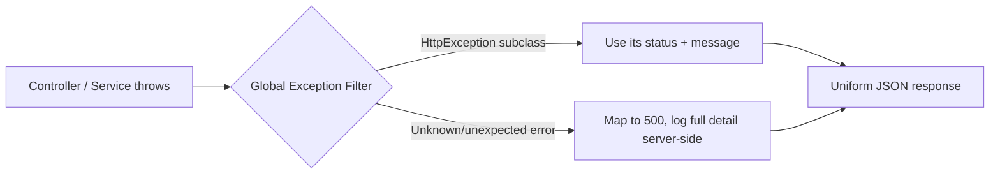
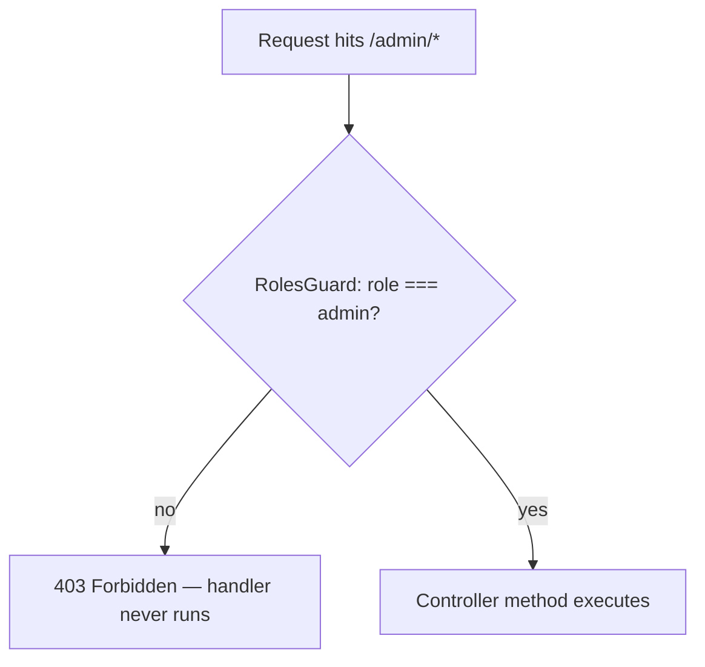
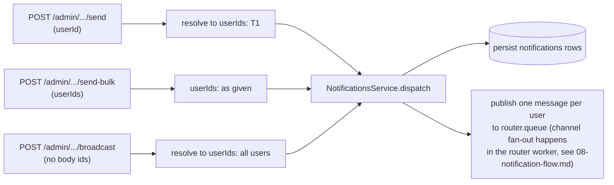

# 05 — API Design: The Contract Everything Else Builds On

Phase 1 established that the API's job shrinks to *validate, persist, publish, respond*.
Phase 2 established the messaging internals behind "publish." This phase is about the other
side of that boundary: the actual HTTP contract a client — our Next.js frontend today, a mobile
app tomorrow, an admin dashboard, even a curl script — talks to. Everything downstream
(workers, FCM, retries) is invisible to a client. The API is the *entire* interface they get.

## Why the API shape matters more than it looks like it should

It's tempting, on a solo learning project, to treat the API as an afterthought — "I'll just add
endpoints as I need them." That approach breaks the moment a second consumer shows up. The
project brief is explicit that **the same API must work for a future mobile app unmodified** —
that's not a nice-to-have, it's a constraint that forces discipline now:

- If the web frontend calls one shape of endpoint and a future mobile client needs a slightly
  different one, you either maintain two APIs or you go back and break the first client to fix
  the second. Neither is acceptable once something depends on the contract.
- A REST API with inconsistent response shapes, ad-hoc error formats, and undocumented
  pagination is fine when *you* are the only client and you remember every quirk. It stops
  being fine the instant anyone else — including future-you, six months from now — has to
  integrate against it without reading the source.

This is why we fix the shape deliberately, once, here — rather than growing it endpoint by
endpoint under time pressure.

## The full endpoint surface

| Area | Method + Path | Purpose |
|---|---|---|
| Auth | `POST /auth/signup` | Create a user, return a JWT |
| Auth | `POST /auth/login` | Authenticate, return a JWT |
| Notifications | `GET /notifications` | Paginated list for the current user, filterable by read/unread |
| Notifications | `GET /notifications/:id` | Fetch one notification (must belong to the caller) |
| Notifications | `PATCH /notifications/:id/read` | Mark one notification as read |
| Notifications | `DELETE /notifications/:id` | Delete one notification |
| Device tokens | `POST /device-tokens` | Register or update an FCM token for the current user |
| Device tokens | `GET /device-tokens` | List the current user's registered devices |
| Device tokens | `DELETE /device-tokens/:id` | Remove a device token (e.g. on logout) |
| Preferences | `GET /preferences` | Current channel/category enabled flags for the user |
| Preferences | `PATCH /preferences` | Update one or more preference flags |
| Admin | `POST /admin/notifications/send` | Send to one user |
| Admin | `POST /admin/notifications/send-bulk` | Send to a list of user IDs |
| Admin | `POST /admin/notifications/broadcast` | Send to every user |

Everything here maps 1:1 onto the `users`, `device_tokens`, `notification_preferences`, and
`notifications` tables described in `database-design.md` — the API is deliberately a thin,
validated surface over that schema plus the publish step from Phase 1/2. It doesn't introduce
new concepts of its own.

## Auth: intentionally minimal

`POST /auth/signup` and `POST /auth/login` exist only to produce an authenticated `user_id` and
a `role` (`user` or `admin`) that every other endpoint can trust. We deliberately do **not**
build refresh tokens, OAuth, or email verification. This isn't laziness — it's scope control:
the thing we're here to learn is queues, workers, and delivery, not identity systems. A single
signed JWT (containing `sub` = user id and `role`), checked by a guard on every protected route,
is enough to answer the one question the rest of the system actually needs answered: *who is
making this request, and are they an admin?*

```
CreateUserDto   { email: string; password: string; name: string }
LoginDto        { email: string; password: string }
```

`signup` hashes the password (never store plaintext — this is the one piece of security
hygiene worth keeping even in a minimal auth setup) and returns a token. `login` verifies the
hash and returns the same shape of token. Every other controller in the system reads the user
off the validated JWT — nothing downstream needs to know *how* the user authenticated, only
*that* they did.

## Request validation: reject bad input before it touches the database

Every mutating endpoint (`POST`, `PATCH`) accepts a **DTO** (Data Transfer Object) — a plain
class describing exactly what shape of body is acceptable, annotated with `class-validator`
decorators. NestJS's global `ValidationPipe` runs these checks automatically before the
controller method body executes:

```
class RegisterDeviceTokenDto {
  @IsString()
  @IsNotEmpty()
  fcmToken: string;

  @IsEnum(Platform)
  platform: Platform; // ios | android | web
}

class UpdatePreferenceDto {
  @IsEnum(Channel)
  channel: Channel; // push | email | sms | inapp | whatsapp

  @IsEnum(Category)
  category: Category; // transactional | promotional

  @IsBoolean()
  enabled: boolean;
}
```

Why bother with this instead of checking `if (!body.fcmToken) throw ...` by hand in every
handler? Because hand-written checks are inconsistent by construction — one developer (or one
tired Tuesday) forgets a check, and now malformed data reaches the service layer or the
database. A DTO + pipe makes "what is valid input" a declared, enforced fact, checked the same
way on every route, with the same error format on every failure. This matters even more once a
second client (mobile) exists — the validation rules are the actual documented contract, not
tribal knowledge.

## Consistent error shape: one exception filter, not scattered try/catches

Without a shared convention, every controller ends up inventing its own error JSON: one returns
`{ error: "..." }`, another `{ message: "...", code: 400 }`, another just lets an unhandled
exception leak a stack trace to the client. A global **exception filter** normalizes all of
that into one shape, regardless of which layer throws:

```
{
  "statusCode": 404,
  "error": "Not Found",
  "message": "Notification not found",
  "path": "/notifications/9f2e...",
  "timestamp": "2026-07-28T10:15:00.000Z"
}
```



The practical payoff: a mobile client can write **one** error-handling code path — "read
`statusCode`, show `message`" — that works for every single endpoint in the system, forever,
without knowing which controller or service produced the error.

## Pagination for `GET /notifications`

A user's notification history grows without bound, so `GET /notifications` can never return
"all of them." We use simple offset/limit **query-parameter pagination**:

```
GET /notifications?page=1&limit=20&status=unread
```

```
{
  "data": [ /* notification rows */ ],
  "meta": { "page": 1, "limit": 20, "total": 143, "totalPages": 8 }
}
```

`status` (or `read`/`unread`) is a filter, not a separate endpoint — it's just a `WHERE` clause
added to the same paginated query, keeping one endpoint instead of `GET /notifications/unread`,
`GET /notifications/read`, etc. This is the same principle as the admin endpoints below: one
underlying query, parameterized, rather than N near-duplicate routes. (Cursor-based pagination
is the more scalable answer for very large, frequently-changing datasets — worth knowing about,
overkill for this project's scale right now.)

## Admin endpoints: a separate module, guarded once

All three admin endpoints live under `/admin/...`, in their own `AdminModule`, protected by a
single `RolesGuard` checking `role === 'admin'` off the JWT — applied once, at the module/
controller level, not repeated as an `if` check inside every handler.



Why a guard instead of scattered checks? Three reasons that all come back to *one place to get
it right*:
1. **You can't forget it.** If the check lives inside each handler, adding a new admin endpoint
   later means remembering to paste it in again. A guard applied at the controller/module level
   protects every route under it automatically, including ones added afterward.
2. **It's testable in isolation.** You can unit-test "does this guard reject a non-admin JWT?"
   once, instead of re-verifying the same logic embedded in N different handlers.
3. **It separates *who can call this* from *what this does*.** The controller method should
   only ever have to reason about the business logic, not re-derive authorization on every
   line.

### Why all three admin endpoints are the same operation underneath

```
SendNotificationDto      { userId: string; title: string; body: string; category: Category; data?: object }
SendBulkNotificationDto  { userIds: string[]; title: string; body: string; category: Category; data?: object }
BroadcastNotificationDto { title: string; body: string; category: Category; data?: object }
```

Look closely and the only real difference between the three is **how the list of target user
IDs is produced**:

| Endpoint | Where `userIds` comes from |
|---|---|
| `send` | A single ID in the body, wrapped into a one-element array |
| `send-bulk` | Explicit array in the body |
| `broadcast` | `SELECT id FROM users` (or a scoped subset) at request time |

Every one of them ends the exact same way: for each target user, persist a `notifications` row
and publish a message. If we implemented this as three separate services with their own copies
of "persist + publish," a bug fix or a behavior change (e.g. "respect notification preferences
before sending") would have to be applied three times, and would inevitably drift. Instead, all
three controller methods resolve their respective `userIds[]` and hand off to **one**
`NotificationsService.dispatch(userIds, payload)` call:



This is the same "collapse near-duplicates into one parameterized path" instinct as the
pagination filter above — three thin controller entry points, one real implementation.

## Swagger/OpenAPI: documenting the API is part of building it, not an extra step

Every controller and DTO is annotated with `@nestjs/swagger` decorators (`@ApiTags`,
`@ApiProperty`, `@ApiResponse`), and NestJS serves a live, interactive spec at `/api/docs`. On a
solo learning project it's fair to ask "who am I documenting this for?" — three concrete
answers:

1. **The future mobile client**, which is a stated requirement of this project. Without a
   generated spec, "the API" only exists as tribal knowledge in your head or scattered NestJS
   route decorators — a mobile developer (future you, or a real teammate) would have to read
   controller source to know what a request body must look like. An OpenAPI spec is a
   machine-readable contract that can even generate a typed client automatically.
2. **You, later.** Six months from now you will not remember whether `read` was a boolean query
   param or a separate route. Documentation-as-you-build costs almost nothing (decorators you'd
   half-write anyway for validation) and eliminates that entire class of "wait, how does this
   endpoint work again?" moment.
3. **It forces the same discipline as the DTOs above.** You cannot accurately document an
   endpoint whose input/output shape is inconsistent or ad-hoc — writing the Swagger annotation
   is often what surfaces "wait, this response shape doesn't match that one" *before* a real
   client depends on the mismatch.

## Checkpoint

1. Why do `send`, `send-bulk`, and `broadcast` share one service method instead of three
   separate implementations? What would go wrong if they didn't?
2. If a mobile app is added later and it needs a *different* error format than the web
   frontend, what part of this design would you have to change? What does that tell you about
   why the global exception filter format was worth getting right early?
3. Why is a `RolesGuard` applied at the module/controller level a stronger guarantee than an
   `if (user.role !== 'admin')` check inside every admin handler?
4. Why does `GET /notifications` need pagination at all — what actually breaks if it just
   returned every row for a user?

## Common interview angle

"How would you design pagination and error handling for a public API?" tests whether you
default to consistency-by-convention (one exception filter, one pagination shape, applied
everywhere) versus consistency-by-memory (repeating the same pattern by hand in every handler
and hoping nothing drifts). The stronger answer names the specific mechanism — a global pipe, a
global filter, a shared guard — not just "I'd be consistent."
