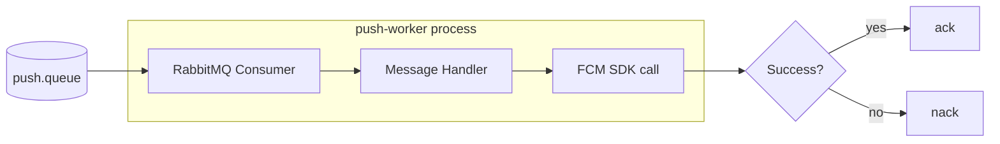
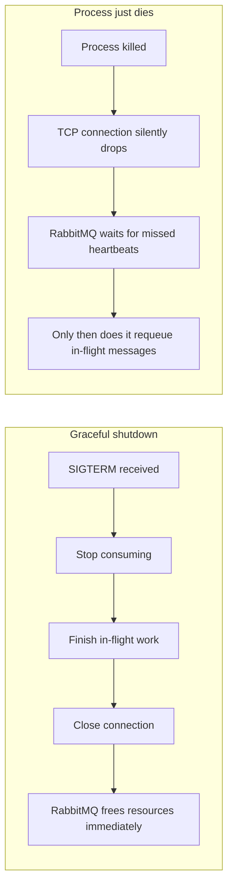
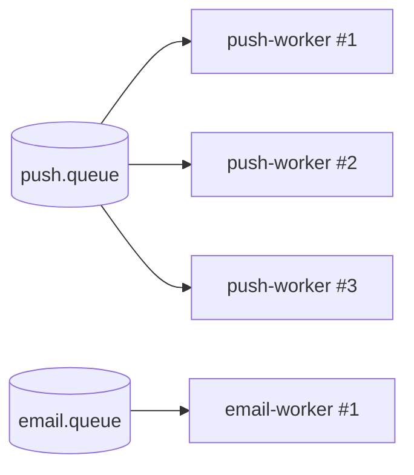

# 06 — Background Jobs and Workers: Turning a Message Into a Side Effect, Safely

Phase 1 drew the line: the API's job ends at *publish*. Phase 2 covered what happens to a
message between publish and delivery — exchanges, bindings, queues, ack/nack. This phase is
about what sits on the *other* end of a queue, permanently running, waiting: the **worker**.

## What a worker concretely is

Strip away the buzzword and a worker in this project is a small, boring thing: **a NestJS
microservice process whose only job is to connect to RabbitMQ, subscribe to exactly one queue,
and for each message, call one channel provider** (FCM for push, a DB insert for in-app, later
SendGrid/Twilio for email/SMS). It has no HTTP server, no routes, no controllers in the REST
sense — its entire surface area is "receive a message, do one thing with it, ack or nack."

Concretely, we run one such process per channel: a `push-worker`, an `email-worker`, an
`inapp-worker`, and so on — each is its own deployable unit (its own `main.ts`, own container/
process), each bound to exactly one queue (`push.queue`, `email.queue`, `inapp.queue`). This
mirrors the "one queue per channel" decision from Phase 2 directly: one queue, one worker type,
one external dependency to call. Nothing about the push worker's code needs to know email or
SMS exist at all.

There's one worker that doesn't fit this "one channel, one provider" mold: the
**router-worker**, consuming `router.queue` (see `02-rabbitmq-fundamentals.md` and
`08-notification-flow.md`). It calls no external provider — its one job is to load
`notification_preferences` for the target user(s) and republish the message once per enabled
channel. Everything said below about lifecycle, prefetch, and crash recovery applies to it
identically; it's just a worker whose "side effect" is publishing more messages instead of
calling FCM/SendGrid.

## Event-driven consumption vs. time-based scheduling — two different problems

It's easy to lump "background processing" into one bucket, but workers here solve a
fundamentally different problem than a cron job would, and conflating them leads to confused
designs:

| | Event-driven queue consumption (what we build) | Time-based scheduling (cron-style) |
|---|---|---|
| Trigger | "A message arrived" | "The clock says 8:00 AM" |
| Cardinality | One message → one unit of work | One tick → work computed fresh (e.g. query "who needs a digest today?") |
| Example here | A notification was queued the moment an order was placed | "Send every user a daily digest of unread notifications every morning" |
| Failure unit | One message can fail/retry independently of others | A whole run either happens or is missed; retry means re-running the whole job |

A future "daily digest" feature is a **scheduler** problem (something like a cron trigger
periodically asking "who's due?" and *generating* messages), not a worker problem — the worker
that eventually sends each digest push would still be this same event-driven pattern, but
*something upstream* would need to decide, on a timer, to publish those messages in the first
place. We are **not** building that scheduler now — it belongs to the "Recap & Future
Improvements" phase in the roadmap. It's worth naming here only so the distinction doesn't get
blurred: everything in this document is about reacting to messages that already exist, not
about deciding when new ones should be created.

## Worker lifecycle: startup and shutdown are not afterthoughts

A worker is a long-running process, not a request handler — it has a lifecycle the way a server
does, and getting the two ends of that lifecycle wrong causes exactly the kind of message loss
or duplication Phase 2 warned about.

**Startup**, in order:
1. Connect to RabbitMQ (with retry/backoff if the broker isn't up yet — workers often start
   before the broker finishes initializing in local dev/Docker Compose).
2. Assert the exchange and queue exist (`notifications.topic`, `push.queue`, plus the
   `retry.queue`/`failed.queue` pair) — idempotent, safe to run on every startup, and means a
   fresh environment doesn't require a manual setup step.
3. Set **prefetch** (QoS) before consuming — this must happen before step 4, or the broker may
   flood the consumer with unacknowledged messages before the limit takes effect.
4. Begin consuming — only now does the handler function start receiving messages.

**Shutdown**, triggered by `SIGTERM` (what container orchestrators and `docker stop` send):
1. Stop accepting *new* messages — tell RabbitMQ to cancel the consumer subscription.
2. Let in-flight messages (already delivered, not yet ack'd) finish processing, up to a bounded
   grace period. If a message can't finish in time, letting the connection close without an ack
   is fine — Phase 2 already established that RabbitMQ requeues un-acked messages when a
   consumer disconnects.
3. Close the AMQP connection cleanly (a proper close handshake), rather than letting the process
   die and forcing RabbitMQ to detect the drop via a missed heartbeat.

That third point is easy to dismiss as pedantic, but it's a real, concrete cost difference:

A graceful close means RabbitMQ frees the consumer slot and requeues nothing unnecessarily,
instantly. An ungraceful death means every in-flight message sits "reserved" to a dead consumer
until the heartbeat timeout (tens of seconds, depending on config) expires — during a rolling
deploy of many worker instances, that adds up to real, visible delivery delay.

## Concurrency within a worker vs. running multiple worker instances

There are two separate knobs for "how much work happens at once," and they solve different
problems:

- **Concurrency within one process** — how many messages a single worker instance handles in
  parallel (e.g. `await`-ing several FCM calls concurrently rather than one at a time). This
  raises throughput per process but shares the same CPU/memory/network budget, and a bug that
  crashes the process takes all of that concurrent work down with it.
- **Multiple worker instances** — running N copies of the exact same `push-worker` process,
  each independently connected to `push.queue`. This is horizontal scaling: more processes,
  potentially on more machines, each with its own resource budget and its own crash blast
  radius.

This is exactly where **prefetch=1**, introduced in Phase 2, does something important: with
prefetch set to 1 per consumer, RabbitMQ won't hand a worker instance a second message until it
acks/nacks the first. Run 5 instances of `push-worker`, each with prefetch=1, and RabbitMQ
naturally load-balances — whichever instance is free next gets the next message, without any of
the instances needing to know the others exist, without a load balancer, without client-side
coordination logic. **The queue is the load balancer.** Raising prefetch above 1 trades some of
that fairness for throughput (a fast instance can grab several messages ahead), which is a
reasonable tradeoff once you've measured it's needed — but it's not the default, because the
default should be "one slow message can't starve messages that would otherwise go to an idle
instance."

## Scaling workers independently, per channel

Because each channel has its own queue and its own worker type, scaling one channel never
requires touching another. Push notification volume and email volume are not the same shape of
traffic — a flash-sale broadcast might fire 100,000 pushes in a burst, while transactional
emails trickle steadily at a fraction of that rate. If push and email shared one worker pool,
a push burst would starve email delivery (or vice versa) purely due to resource contention that
has nothing to do with either channel's actual logic.

Three push instances, one email instance — sized independently, deployed independently,
restarted independently. This is the direct payoff of the Phase 2 decision to give every
channel its own queue rather than one shared work queue with a "channel" field workers have to
filter on: filtering in application code can't give you independent scaling, only independent
queues can.

## Failure recovery: what happens to in-flight work on a crash

This is a direct application of the ack/nack model from Phase 2, applied to the worker's own
lifecycle rather than to business-logic failures:

- **Worker crashes mid-handler** (unhandled exception, OOM kill, `docker kill`) — the message
  was delivered but never ack'd. RabbitMQ detects the dropped connection and automatically
  requeues the message for redelivery to another (or the same, once restarted) consumer.
  Nothing is silently lost.
- **Handler runs, provider call succeeds, but the process dies before the ack is sent** — the
  message gets redelivered even though the side effect (e.g. the push) already happened. This
  is the concrete case that makes idempotent handling mandatory: the worker must check the
  `notification_delivery_logs` row before resending, so a redelivered message becomes a no-op
  rather than a duplicate push.
- **Handler explicitly nacks** (provider returned an error) — this is a normal, expected retry
  path, not a crash. It routes to `retry.queue` per the TTL+DLX pattern from Phase 2, capped by
  the retry-count header, eventually landing in `failed.queue` if it never succeeds.

The crash case and the explicit-nack case look identical from RabbitMQ's point of view in one
important way — both result in the message coming back for another attempt — which is exactly
why idempotency has to be a property of the handler itself, not something bolted on only for
the "expected" retry path.

## What actually signals "this worker needs to scale"?

A common instinct is to watch CPU usage and scale when it's high. For a queue-consuming worker,
that's the wrong signal, for a simple reason: a worker making network calls to FCM/SendGrid/
Twilio spends most of its time **waiting on I/O**, not computing — CPU can sit comfortably low
even while the worker is badly behind.

The signal that actually matters is **queue depth over time** — specifically, whether the
number of ready (unconsumed) messages in `push.queue` is growing, shrinking, or flat:

| Queue depth trend | What it means | Action |
|---|---|---|
| Flat, near zero | Consumers keep up with publish rate | No change needed |
| Growing steadily | Publish rate > consume rate — falling behind | Add worker instances (scale out) |
| Spikes then drains | Bursty traffic, but capacity is sufficient overall | Fine, maybe autoscale on this signal |
| Growing and never draining | Structural under-capacity or a stuck/crash-looping worker | Investigate immediately — this is the queue filling up toward a possible outage |

RabbitMQ's management UI (the same one from Phase 2's hands-on exercise) exposes this directly
per queue — messages ready, messages unacked, and the consume rate. A worker with low CPU but a
queue depth climbing every minute is under-scaled; a worker pegging CPU with a flat, near-zero
queue depth is not a scaling problem at all, and adding instances would just be wasted capacity.
This is the concrete, measurable version of "workers scale for delivery volume, independently
of the API," from Phase 1's summary table — queue depth is the metric that turns that sentence
into an actionable decision.

## Recap: how every concept maps onto our project

| Concept | Our usage |
|---|---|
| Worker | `router-worker` (consumes `router.queue`, republishes per channel) plus one process per channel: `push-worker`, `email-worker`, `inapp-worker`, ... |
| Consumption model | Event-driven — one message in, one delivery attempt out; no polling, no timers |
| Startup order | Connect → assert exchange/queues → set prefetch → begin consuming |
| Shutdown order | Stop consuming → drain in-flight → close connection cleanly on `SIGTERM` |
| Concurrency knob | Prefetch per instance (default 1) balances fairness vs. throughput |
| Scaling knob | Number of running instances per channel, sized independently per channel |
| Crash recovery | Un-acked messages auto-requeue; idempotency via `notification_delivery_logs` prevents duplicate sends |
| Scaling signal | Queue depth trend (growing = under capacity), not CPU |

## Checkpoint

1. Why is "send a daily digest every morning" not solved by the same worker pattern as "send a
   push the moment an order is placed"? What's the actual difference in what triggers the work?
2. A worker instance is killed with `SIGKILL` (no graceful shutdown) while holding an unacked
   message. What does RabbitMQ do, and why does that make the handler's idempotency check
   non-optional rather than a nice-to-have?
3. Why does running 5 worker instances with prefetch=1 each achieve load balancing without any
   of them communicating with each other?
4. Your push worker's CPU usage is at 15% but `push.queue`'s ready-message count has been
   climbing for the last hour. Do you scale up, and why might CPU have told you the opposite?

## Common interview angle

"How do you decide when to scale a consumer/worker service?" is a question that filters for
people who've actually operated queue-backed systems versus people who reason from web-server
intuition (CPU/RAM). The strong answer leads with queue depth (or consumer lag, in Kafka terms)
as the primary signal for I/O-bound consumers, and explains *why* CPU is misleading for a
process that spends most of its time waiting on a third-party API rather than computing.
