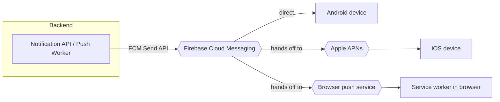
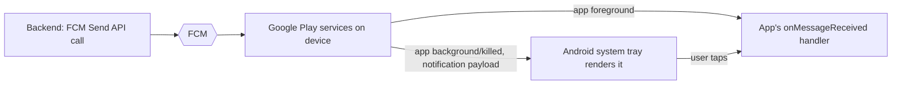
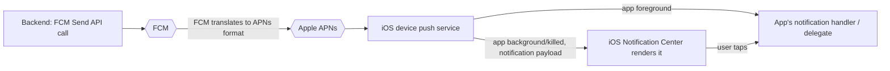
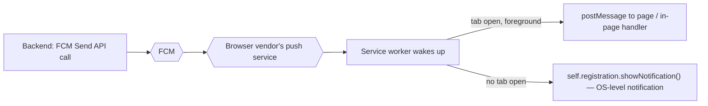
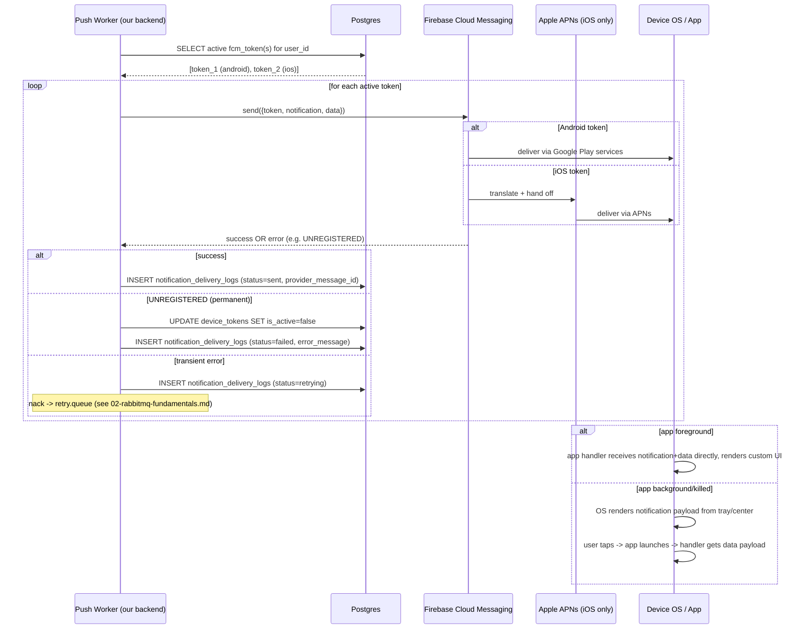

# 07 — FCM Complete Guide: How a Push Notification Actually Reaches a Phone

Phase 6 gave us workers that consume messages and "do the side effect." For the push channel,
that side effect is: call Firebase Cloud Messaging (FCM). This doc is entirely about what's on
the other side of that call — because "call FCM" hides an enormous amount of machinery, and
if you don't understand it, the `device_tokens` table and the retry logic around it will look
like arbitrary bureaucracy instead of the necessary response to real failure modes.

## What FCM actually is, and where it sits

FCM is **Google's push delivery service**. It is not the thing that puts a banner on a user's
screen — it's the transport layer that sits between your backend and the platform-level push
infrastructure that Apple and Google actually control.

The critical thing to unlearn: **your backend never talks to a device directly, and FCM
doesn't either, for iOS.** Every OS vendor gates push delivery through their own infrastructure,
because only they maintain the persistent, battery-efficient connection between a device and
the network:

- **Android** devices maintain a persistent connection to Google's own push infrastructure.
  FCM *is* that infrastructure on Android, so FCM can deliver directly.
- **iOS** devices maintain a persistent connection to **APNs** (Apple Push Notification
  service) — Apple's own infrastructure, which Google does not control and cannot bypass. So
  for iOS, FCM's job is to accept your request, translate it into APNs' format, and hand it off
  to APNs, which does the actual delivery to the device.
- **Web** push (browser tabs, PWAs) goes through yet another layer — the browser vendor's push
  service (Google's for Chrome, Mozilla's for Firefox) — mediated by a **service worker**
  running in the browser.



This is why FCM is called an **abstraction layer**, not "the" push system: it gives you one
API and one payload format, and it deals with the fact that Android, iOS, and Web each have
their own underlying delivery mechanism you'd otherwise have to integrate separately (APNs
certs, Web Push protocol keys, etc.).

## Device tokens: what they are and why one user has many

A **device token** (also called a registration token) is an opaque string that Firebase's SDK
generates on the client the first time the app initializes messaging. It uniquely identifies
**one app installation on one device** — not a user, not even a device in general.

Concretely, the client-side flow is:

1. App starts, requests notification permission from the OS (required on iOS and modern
   Android; implicit but revocable on older Android).
2. If granted, the Firebase SDK registers the app instance with FCM's backend and receives a
   token back.
3. The app sends this token to *your* backend, which is where `POST /device-tokens` comes in
   (see `api-design.md`) — you have to explicitly ship the token to your own server; Firebase
   has no idea who "the user" is in your system.

### Why tokens are per-install, not per-user

This is the detail that explains the whole shape of the `device_tokens` table. A token is
invalidated and regenerated whenever:

- The app is reinstalled (uninstall + reinstall = new install = new token).
- The user clears app data.
- The underlying FCM registration is refreshed by the OS/SDK (this happens periodically and
  silently, for reasons entirely internal to Firebase — you don't control it, you just have to
  handle it).
- The app is restored onto a new device (a backup restore does *not* carry the old token —
  it's tied to the physical registration, not user data).

One human user, in practice, has: a phone, maybe a tablet, maybe a second phone, maybe the same
app reinstalled after a factory reset with the old token still technically sitting in your DB
until it's cleaned up. That's why `device_tokens` is keyed as `user_id (fk) → many fcm_token
rows`, each with its own `platform` (ios/android/web) and its own `is_active` flag — sending a
push to "a user" always actually means "loop over every active token this user has and send to
each one independently." A single logical notification can fan out to 3 physical FCM send
calls if the user has 3 active devices.

## The single most important distinction: notification payload vs data payload

This is the concept that, if skipped, makes every "why didn't my notification show up /
why did my code not run" bug in a push system unsolvable. FCM messages can carry two
independent payload blocks, and they behave completely differently depending on whether the
app is foregrounded, backgrounded, or killed.

### Notification payload

```json
{
  "notification": {
    "title": "Your order has shipped",
    "body": "Order #1042 is on its way"
  }
}
```

When the app is **backgrounded or killed**, a notification payload is intercepted and rendered
**directly by the OS** — Android's system tray, iOS's notification center — without your app
code ever running. Your app only finds out anything happened if/when the user taps it, at
which point the OS launches the app and hands it whatever data was attached. If your app was
never opened, your code has **zero visibility** into the fact that this notification was even
delivered.

### Data payload

```json
{
  "data": {
    "type": "order_shipped",
    "orderId": "1042",
    "notificationId": "a1b2c3"
  }
}
```

A data-only payload **always** reaches your app code — via a background handler on Android, a
background app refresh/notification-service-extension on iOS — regardless of app state. The OS
does not render anything for you. You are responsible for deciding what to show, or for running
silent logic (updating local cache, incrementing a badge count, syncing something) with no
visible UI at all.

### Why this matters for a real system

| Approach | What you get | What you lose |
|---|---|---|
| Notification-only | OS renders it for free, works even with minimal app code, survives app being killed | Your backend has no way to run custom logic (e.g. mark as delivered) unless the user taps it; you can't customize rendering per-platform from one payload |
| Data-only | Full control: custom rendering, silent sync, you can log "reached device" the moment the handler fires | You must write and maintain your own notification-rendering code on every platform; if the app is killed on Android, data-only delivery can be delayed/coalesced by the OS's Doze/battery-optimization behavior |
| Both (send `notification` + `data` together) | OS renders a default notification even if your handler never runs (safety net for killed/background state), *and* your data fields are available if/when the app does run | Slightly bigger payload; you must design your code to not double-handle the same event when both fire |

Production systems (the pattern Uber/LinkedIn-style notification services use) generally send
**both** for user-facing alerts, or go **data-only** when they need guaranteed custom handling
(e.g. silently refreshing an in-app badge count) and are willing to build their own rendering.
In this project, our push worker will default to sending both blocks: `notification` for the
guaranteed OS-rendered fallback, and `data` carrying `notificationId` + `category` so the app,
if running, can correlate the tap back to a `notifications` row via
`GET /notifications/:id`.

## Foreground vs background handling

This follows directly from the above, but is worth stating explicitly because it trips people
up in exactly the opposite direction from what they expect:

- **App in foreground:** neither Android nor iOS auto-renders a `notification` payload. *Both*
  blocks are delivered straight to your app's foreground message handler — if you want the user
  to see anything, **you** must render it yourself (e.g. a custom in-app toast). This is
  actually the same work as handling in-app notifications from `inapp.queue` in this project —
  the rendering responsibility is on your app code either way.
- **App backgrounded or killed:** the OS handles `notification` payloads for you (see above);
  `data` payloads go to a background handler with platform-specific restrictions (limited
  execution time, possible OS throttling).

## Android delivery flow



## iOS delivery flow



The extra hop through APNs is also why iOS push requires its own credentials configured
*inside* Firebase (an APNs auth key or certificate uploaded to your Firebase project) — Firebase
is acting as a client of APNs on your behalf, and Apple requires that hop to be authenticated
separately from your FCM server key.

## Web Push flow (service workers)

Web push has no OS-level tray to hand off to — the browser plays that role, mediated by a
**service worker**: a script the browser runs in the background, independent of any open tab.



The registration token for web push is generated by `firebase-messaging-sw.js` (the service
worker file) using a VAPID key pair configured in your Firebase project — conceptually the same
"token identifies this one browser-profile install" idea as the mobile token, just obtained
through the browser's Push API instead of a native SDK.

## Token refresh, expiration, and invalid tokens (the cleanup problem)

Tokens are not permanent. They can silently go stale for any of the reasons listed earlier
(reinstall, cleared data, OS-triggered refresh, user revoking notification permission). Your
backend has no push notification telling it "hey, this token died" — the *only* way you find
out is by trying to send to it and reading the error FCM's send API gives you back.

The key error to know: when you call the FCM send API with a dead token, the response comes
back with an error code like **`UNREGISTERED`** (or, in older HTTP API versions,
`NotRegistered`/`InvalidRegistration`). This means: *this token will never work again, stop
trying.*

This is not an edge case you can ignore — in a system with real users, a meaningful fraction of
stored tokens are stale at any given time (people uninstall apps constantly), and re-sending to
a dead token on every notification is wasted work forever unless you react to it.

### How this project reacts to it

1. The push worker calls FCM's send API for each active token belonging to the user.
2. It writes the outcome to `notification_delivery_logs` (one row per channel attempt),
   including `error_message` if FCM rejected it.
3. If the specific error is `UNREGISTERED` (a **permanent** failure, not a transient one), the
   worker does **not** feed it into the retry pattern from `02-rabbitmq-fundamentals.md` — retrying
   a dead token 5 times accomplishes nothing, it will fail identically every time. Instead, it
   flips that row in `device_tokens` to `is_active = false` immediately, and marks the delivery
   log `status = failed` directly.
4. Any *other* error (network blip, FCM rate limit, transient 5xx) **is** a candidate for the
   retry pattern, because it might succeed on the next attempt.

This is the general principle worth internalizing: **not all failures deserve a retry.** A
retry queue is for "this might work if we try again later." A dead token is not that — it's
"this will never work," and the correct response is a state change (deactivate), not a delay.
Confusing the two is a common real-world bug: teams that blindly retry every FCM failure end up
burning retry budget on tokens that were never coming back, while genuinely transient failures
get the same treatment as permanent ones.

## FCM Topics and Device Groups — FCM's own multicast features

**Naming collision warning, read this carefully:** FCM has a feature literally called
**"Topics."** This has **nothing to do** with the RabbitMQ **topic exchange** described in
`02-rabbitmq-fundamentals.md`. They are two completely unrelated systems from two completely
unrelated vendors that both happened to pick the English word "topic." Do not let the shared
word imply a shared mechanism — there is no code path in this project where "FCM Topic" and
"RabbitMQ topic exchange" interact or need to agree with each other.

| | RabbitMQ topic exchange | FCM Topic |
|---|---|---|
| Lives in | Our own RabbitMQ broker | Google's FCM backend |
| Purpose | Route **our internal messages** to the correct **channel queue** (push/email/inapp/...) based on a routing key pattern | Let a device **subscribe itself** to a named group (e.g. `"sports-news"`) so FCM can push to everyone subscribed with **one API call**, without your backend tracking each token |
| Who defines membership | Bindings we configure between exchange and queue | The **client app** calls `subscribeToTopic("sports-news")` on-device; Google tracks the subscriber list, not us |
| Granularity in this project | Internal plumbing, invisible to end users | A product feature — e.g. broadcasting to "all users who opted into promotions" without our backend looping over every token |

A **Device Group** is FCM's older, more limited multicast mechanism: grouping a *fixed* set of
tokens (typically one user's multiple devices) under one notification key so one send call
reaches all of them. FCM Topics have mostly superseded this use case; we mention Device Groups
only so you recognize the term if you see it in FCM docs — this project does not use it,
because our `device_tokens` table plus a loop over "this user's active tokens" already solves
the same problem (per-user multi-device fan-out) at the application layer, which also lets us
log a delivery outcome per token in `notification_delivery_logs` — something FCM Device Groups
don't give you visibility into.

For our `POST /admin/notifications/broadcast` endpoint, we are **not** using FCM Topics either
— we broadcast by looping over device tokens ourselves (via the normal `notifications.topic` →
`push.queue` → push worker path), specifically because we want every broadcast recipient to get
their own `notifications` row and `notification_delivery_logs` entry. Using an FCM Topic would
send the OS-level notification without our backend ever knowing who actually received it,
which conflicts with this project's whole point: tracking delivery per user.

## Silent / data-only notifications

A **silent notification** is a data-only payload sent with no `notification` block and,
critically, with platform-level flags telling the OS not to show any UI at all (on iOS this is
`content-available: 1` with no alert/sound/badge; on Android it's simply the absence of a
`notification` block). Its entire purpose is to wake the app's background code without
bothering the user — e.g. "your subscription's data changed, silently refresh your local
cache next time the app opens." We're not building a feature that needs this yet, but it's the
same `data`-payload mechanism described above, just deliberately paired with "don't render
anything."

## Full lifecycle: backend call to notification handled on device



## Checkpoint

1. Why can't FCM deliver directly to an iOS device the way it can to Android? What system sits
   in between, and why does that matter for how you configure Firebase?
2. A user has the app installed on two phones and a laptop browser. How many rows does
   `device_tokens` have for them, and why is that the correct model instead of one row per user?
3. Your push worker sends the same payload structure to 10 devices; 2 come back
   `UNREGISTERED` and 1 comes back with a transient network error. What should happen to each
   of the 3, and why shouldn't they be treated the same way?
4. Explain, without using the word "topic" for either side, the actual difference between FCM
   Topics and the RabbitMQ topic exchange this project uses internally.

## Common interview angle

"How do push notifications actually get delivered, end to end?" is a favorite systems question
because it's easy to answer shallowly ("you call an API and it shows up") and hard to answer
precisely. The strong answer names the hand-off chain (your backend → FCM → APNs for iOS →
device), explains the notification-vs-data payload distinction and why it changes what code
runs and when, and explains that token invalidation is discovered reactively via send-time
errors, not pushed to you proactively — which is exactly why a `device_tokens.is_active` flag
and delivery-log-driven cleanup process are load-bearing, not optional polish.
