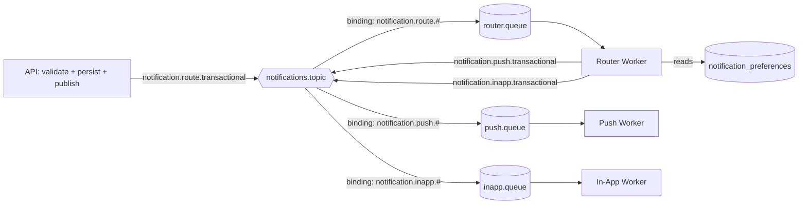
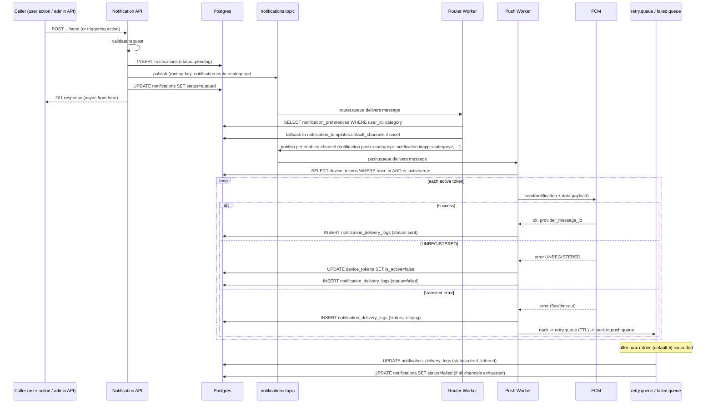

# 08 — The Canonical End-to-End Notification Flow

Every other doc so far explained one piece in isolation: why async exists (01), how RabbitMQ
routes messages (02), how FCM actually delivers a push (07). This doc has one job — wire all of
it together, plus the Postgres schema (`database-design.md`) and REST API (`api-design.md`),
into **the one flow every notification in this system follows**, regardless of channel. If you
can trace a single notification through every step below, you understand the whole project.

## The design decision this doc makes (read this first)

The project brief originally sketched a flow where the API itself figures out which channels a
notification should go to (push? email? both?) before publishing. This doc makes a deliberate
change to that: **channel selection happens in a dedicated router worker stage, after
publishing, not inside the API request.** The rest of this doc explains the flow with that
decision baked in, and the "Comparing this to the original flow" section at the bottom
justifies it explicitly.

**Routing key decision, stated plainly:** the API does **not** know the final channel(s) when
it publishes. It publishes once, with a routing key that encodes only the **category**, using a
reserved pseudo-channel segment `route` — e.g. `notification.route.transactional`. A new
**router worker**, bound to a new **`router.queue`** (binding pattern `notification.route.#`),
consumes that message, loads `notification_preferences` for the user, decides the real channel
list, and **re-publishes** once per enabled channel using the routing key shape already
established in `02-rabbitmq-fundamentals.md` — `notification.<channel>.<category>` — which the
existing per-channel bindings (`notification.push.#`, `notification.email.#`, ...) pick up
exactly as before. This is one more queue and one more binding on the *same* exchange, not a new
exchange — it fits the existing "one topic exchange, N bindings" model without breaking it.

## Why a router stage instead of deciding channels in the API

The API's job, established in `01-system-overview.md`, is strictly **validate, persist, publish,
respond** — nothing slow or branch-heavy. Loading `notification_preferences` and turning that
into "these N channels are enabled for this user+category" is a small piece of business logic,
but it is still *logic on the write path*, and putting it there causes three concrete problems:

1. **It re-couples something Phase 1 decoupled.** If preference lookup happens synchronously in
   the API handler, a slow or misbehaving preferences query now adds latency to every single
   notification request — exactly the kind of coupling the async split exists to prevent.
2. **It can't be retried independently.** If channel-selection logic has a bug, or preferences
   data is briefly inconsistent, and this logic lives in the API, the only way to "retry
   routing" is to have the client re-send the original HTTP request. If it lives in a consumer
   instead, a router worker crash or bug just means the message sits in `router.queue` (or gets
   requeued) until routing succeeds — the same reliability story RabbitMQ already gives every
   other stage.
3. **It doesn't generalize to admin fan-out.** `POST /admin/notifications/broadcast` needs to
   apply this same "which channels does *this* user have enabled" decision to potentially
   thousands of users. Doing that inline in the request handler means the HTTP request itself
   blocks on thousands of preference lookups. Doing it in a worker means the API publishes one
   message per recipient (or one fan-out message the router expands) and returns immediately;
   the router chews through preference lookups at its own pace, exactly like any other queue
   consumer.

The cost of this choice is one extra hop (an extra publish + consume) per notification, and one
extra queue to operate. That's a fair trade for keeping "what happened" (the API's job)
separate from "who should be told and how" (the router's job) — which is the same
separation-of-concerns argument Phase 1 already made for pushing delivery out of the request
path in the first place.

## Full flow, step by step

### 1–3: Request arrives, gets validated, gets persisted

A client (or an admin caller) hits one of the send-triggering endpoints — user-facing actions
that create notifications indirectly, or directly via `POST /admin/notifications/send`. The API:

1. Validates the request shape (title/body or `template_id`, target `user_id`, `category`).
2. Persists a row in `notifications`: `status = 'pending'`, `user_id`, `template_id` (nullable
   if not template-based), `title`, `body`, `category`, `data` (jsonb, for any structured
   payload the eventual push/data payload will carry).

At this point the notification exists durably in Postgres even if RabbitMQ were completely
unreachable a moment later — this is the same "persist before you depend on the queue" ordering
implied throughout Phase 1: the database write is the source of truth that a notification was
*requested*; everything after this is about getting it *delivered*.

### 4: Publish to the router

The API publishes one message to `notifications.topic` with routing key
`notification.route.<category>` (e.g. `notification.route.transactional`), carrying the
`notifications.id` (not the full payload — the router will re-read from Postgres, which avoids
stale-data bugs if something changes between publish and consume). The API then updates
`notifications.status = 'queued'` and returns its response to the caller. The synchronous part
of the request is now over.

### 5: Router worker consumes, loads preferences, re-publishes per channel

The router worker consumes from `router.queue`. For the `user_id` and `category` on the
notification, it queries `notification_preferences` for every row matching that user, filtered
by `category`, and collects the channels where `enabled = true`. If a user has no explicit
preference row for a channel, the system falls back to the template's `default_channels` (jsonb
on `notification_templates`) — this is why that column exists: it's the default fan-out list
before any user has customized anything.

For each resulting channel, the router publishes a **new** message to `notifications.topic`
with routing key `notification.<channel>.<category>` — e.g. `notification.push.transactional`
and `notification.inapp.transactional` if both are enabled. This is the actual fan-out moment
in the system: **one row in `notifications` can become N messages**, one per enabled channel,
each independently routed, retried, and logged from here on.

### 6: Channel worker consumes

Each channel worker (one NestJS microservice per channel — see `02-rabbitmq-fundamentals.md`'s
recap table) consumes from its own queue with `prefetch = 1`. On receiving a message, it can
optionally flip `notifications.status = 'processing'` (a simplification worth naming
explicitly: because one `notifications` row can fan out to multiple channels, this project
treats `notifications.status` as a coarse, overall-progress indicator — the precise, per-channel
truth always lives in `notification_delivery_logs`, not in this one column).

### 7: Push worker specifically — load tokens, call FCM

This step is the entire subject of `07-fcm-complete-guide.md`; here's how it plugs into this
flow specifically. The push worker:

1. Loads all `device_tokens` rows for the `user_id` where `is_active = true`.
2. For each token, calls the FCM send API with a payload built from the notification's
   `title`/`body` (or the template's `title_template`/`body_template` rendered with `data`),
   sent as **both** a `notification` block and a `data` block (per the guidance in doc 07),
   with `data.notificationId = notifications.id` so a tap can be correlated back to
   `GET /notifications/:id`.
3. Handles the FCM response per-token: success, permanent failure (`UNREGISTERED` →
   deactivate the token), or transient failure (candidate for retry) — exactly as detailed in
   doc 07's "token refresh, expiration, and invalid tokens" section.

### 8: Delivery outcome written to notification_delivery_logs

Every attempt — success or failure, per channel, per token where applicable — gets its own row
in `notification_delivery_logs`: `notification_id`, `channel`, `status`
(`queued`/`sent`/`delivered`/`failed`/`retrying`/`dead_lettered`), `provider_message_id` (FCM's
message ID on success), `error_message` (on failure), `attempt_count`. This table is the actual
audit trail — it answers "did this specific channel, for this specific notification, actually
succeed?" at a granularity the single `notifications.status` column deliberately does not
capture.

### 9: Failure triggers the retry pattern

A transient failure (network blip, FCM/SMTP/SMS-provider 5xx, rate limiting) causes the worker
to `nack` the message without requeueing, which — per the DLX chain built in
`02-rabbitmq-fundamentals.md` — routes it to `retry.queue` (short TTL), which dead-letters back
into the originating channel queue once the TTL expires, incrementing a retry-count header each
cycle. The corresponding `notification_delivery_logs` row is updated to `status = 'retrying'`,
`attempt_count` incremented, so the audit trail shows the retry happening in real time, not just
the eventual outcome.

### 10: Exhausted retries land in failed.queue

Once the retry-count header exceeds the cap (default max 5), the message is routed to the
terminal `failed.queue` instead of back into the retry cycle. The delivery log row is finalized
as `status = 'dead_lettered'`. If **every** channel attempted for a given `notifications` row
ends this way, `notifications.status` is set to `'failed'`; if at least one channel succeeded,
it's set to `'sent'` — again, a coarse summary, with `notification_delivery_logs` remaining the
precise record of which channels actually worked.

## Full sequence diagram

## Comparing this to the original proposed flow

The project brief's original sketch (roughly 14 steps) effectively folded "figure out who gets
told, on which channels" into the API request itself — request comes in, API loads the user,
loads their preferences, decides channels, persists the notification, then publishes N
already-channel-specific messages directly, one per decided channel. The core refinement this
doc makes is moving **exactly one piece** of that — the preferences lookup and channel decision
— out of the synchronous request and into its own asynchronous worker stage:

| | Original (channel decided at API time) | This doc's design (router worker decides) |
|---|---|---|
| Where preferences are read | Inside the HTTP request handler | Inside an async consumer (`router.queue`) |
| What the API publishes | N channel-specific messages directly | 1 generic `notification.route.<category>` message |
| Failure in preference lookup | Fails or delays the HTTP response | Message sits in `router.queue` / gets retried; API already returned |
| Adding a new channel later | No API code change needed (routing already generic) — same as before | Same — no API code change needed either |
| Bulk/broadcast fan-out (1 event → 1000s of users) | API must loop over 1000s of preference lookups before it can even publish | API publishes once (or once per recipient with no preference logic); router worker absorbs the fan-out cost, independently scalable |
| Consistency with Phase 1's "API = validate, persist, publish, respond" rule | Broken — API also *decides routing logic* | Preserved — router logic lives entirely in a consumer |

Everything downstream of "channel decided" — channel queues, workers, FCM calls, delivery logs,
retry/DLQ — is **unchanged** from the original flow; this refinement only moves *where* the
channel decision happens, not what happens after it. The reasoning mirrors exactly why Phase 1
pulled delivery out of the API in the first place: anything that reads from a data store,
branches on business rules, or could plausibly need retrying belongs in a worker, not in the
request/response cycle.

## Checkpoint

1. Why does the API publish a message with routing key `notification.route.<category>` instead
   of already knowing the channel at that point?
2. If the router worker crashes right after reading `notification_preferences` but before
   re-publishing, what happens to the original message, and why doesn't the notification get
   silently lost?
3. Explain why `notifications.status` and `notification_delivery_logs.status` are two separate
   sources of truth instead of one — what question does each answer that the other can't?
4. A user disables the `push` channel for `promotional` category after a notification has
   already been persisted as `pending` but before the router has processed it. At what step
   does that preference change actually take effect, and why does that timing make sense?

## Common interview angle

"How would you fan out one event to multiple notification channels, respecting per-user
preferences, without blocking the request that triggered it?" is really asking whether you
understand that **routing decisions and side effects both belong on the asynchronous side of
the system** — not just the side effects. The strong answer names the specific stage where
preferences are evaluated (a dedicated consumer, not the producer), and explains that this
keeps the producer's job fixed and cheap (persist + publish) regardless of how many channels or
how complex the preference rules become later.
