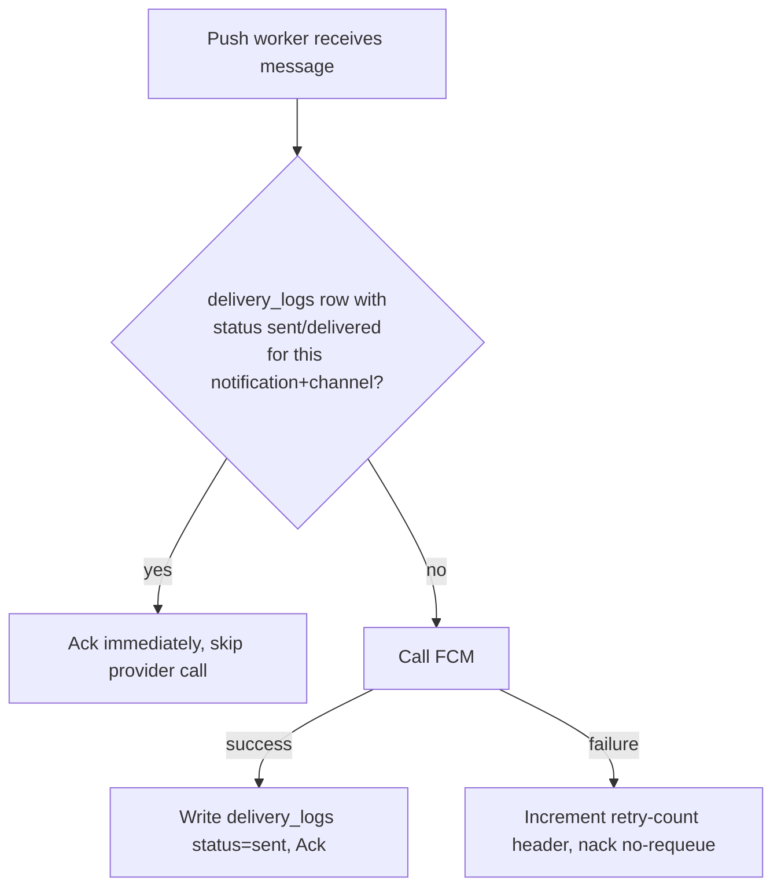

# 09 — Retries and Dead Letter Queues, In Depth

Phase 2 introduced the *shape* of retries: a `retry.queue` with a TTL, dead-lettering back to
the channel queue, capped by a retry-count header, with `failed.queue` as the final resting
place. That's the mechanism. This phase is about the parts that make the mechanism actually
safe to run in production: **idempotency**, a **concrete backoff schedule**, **who owns the
retry-count logic**, and **what a growing DLQ is telling you**.

If you haven't internalized 02-rabbitmq-fundamentals.md's TTL + DLX pattern, stop and re-read
it first — everything below assumes you already know why a queue's TTL alone can't implement
retries without a dead letter exchange attached to it.

## Why idempotency isn't optional here

Recall the core guarantee from Phase 2: RabbitMQ gives you **at-least-once delivery**, never
exactly-once. Two concrete ways the same message reaches a worker twice, both of which *will*
happen in production, not just in theory:

1. The push worker calls FCM, FCM successfully delivers, but the worker process crashes
   (OOM, deploy, node restart) **before** it acks the message. RabbitMQ sees the connection
   drop and requeues the message. A second worker picks it up and calls FCM again.
2. The retry cycle itself double-delivers: a message dead-letters from `retry.queue` back into
   `push.queue` at the same moment a slow consumer is still finishing an earlier, unacked
   attempt at that same message (this happens under prefetch misconfiguration or connection
   blips, not just crashes).

Either way, the channel worker's job function *will* be invoked twice for the same logical
delivery. If that function's only action is "call FCM and send a push," the user gets the
same push notification twice. For a transactional notification ("your payment failed") that's
mildly annoying. For something like "your OTP code" sent twice with a delay, it's confusing
and looks broken.

### The concrete check: `notification_delivery_logs` as the idempotency guard

Before a channel worker calls its provider (FCM, in our current scope), it does one read
against `notification_delivery_logs`:

```sql
select status from notification_delivery_logs
where notification_id = :notification_id
  and channel = :channel
order by created_at desc
limit 1;
```

- If a row exists with `status = 'sent'` or `status = 'delivered'` for this
  `(notification_id, channel)` pair → **do not call the provider again**. Just ack the
  message. The work was already done; this delivery is a duplicate of one we've already
  recorded as successful.
- If no such row exists, or the latest row is `queued` / `processing` / `retrying` → proceed
  with the provider call as normal.

This is deliberately a **read against a row we already need to write anyway** — the delivery
log isn't new infrastructure bolted on for idempotency, it's the audit trail phase 10 needs
("did the user actually get this?"), doing double duty as a deduplication check. That's a
useful pattern in general: idempotency is often free if you already have a durable log of
"did I do this," because the check and the audit trail are the same query.



One subtlety worth naming: this check has a small race window (two workers could both read
"no row yet" before either writes). At this project's scale that's an acceptable risk — closing
it fully would need a unique constraint on `(notification_id, channel, status)` or a
transactional claim step, which is a reasonable "future improvement" but overkill for the
learning goal here. The point to understand is *why* the check exists, not to over-engineer it
on day one.

## A concrete exponential backoff schedule

"Retry with backoff" is easy to say and easy to get vague about. Here's the actual schedule
this project uses, expressed as fixed attempt numbers:

| Attempt | Wait before this attempt | Cumulative time since first failure |
|---|---|---|
| 1 (original) | — | 0s |
| 2 | 30s | 30s |
| 3 | 2 min | ~2.5 min |
| 4 | 10 min | ~12.5 min |
| 5 | 1 hour | ~72.5 min |
| — | exceeds max (5) | routed to `failed.queue` |

Why increasing delays instead of a fixed 30s every time? A transient blip (FCM briefly
returning 500s, a network hiccup) is likely gone within 30s–2min, so early retries are fast.
But if it's still failing after several attempts, the problem is probably *not* transient
(FCM is having a real outage, or something about this specific message is wrong) — retrying
every 30 seconds for an hour would just hammer a struggling downstream service and burn worker
capacity on something unlikely to succeed soon. Spacing retries out further as attempts
increase gives the failure more time to resolve itself while spending less total worker
capacity chasing it.

### Two ways to implement the schedule — and which one we use

**Option A — one retry queue per delay tier.** `retry.30s.queue`, `retry.2m.queue`,
`retry.10m.queue`, `retry.1h.queue`, each with a fixed TTL, all dead-lettering back to the
originating channel queue. The worker picks which retry queue to republish to based on the
current attempt number. Simple to reason about and inspect in the RabbitMQ management UI (you
can *see* how many messages are sitting in the 10-minute tier), at the cost of one queue per
tier per channel.

**Option B — one `retry.queue`, TTL set per-message.** RabbitMQ lets you override a queue's
default TTL on a *per-message* basis via the `expiration` property. So there's a single
`retry.queue`, and the worker sets `expiration` to `30000`, `120000`, `600000`, or `3600000`
(milliseconds) depending on the current attempt count before republishing. Fewer queues to
manage, but you lose the ability to eyeball "how many messages are in the 10-minute bucket"
directly in the UI — you'd need to inspect message headers instead.

This project uses **Option A** conceptually for the diagrams and mental model (it maps more
directly onto "Phase 2's `retry.queue` idea, generalized to four tiers"), but either is a
legitimate answer — the important part is that *some* per-attempt delay value drives which TTL
is used, not that there's exactly one queue.

```mermaid
flowchart LR
    W[push.queue worker] -->|attempt 1 fails, retry-count=1| R1["retry.30s.queue"]
    R1 -->|expires| PQ1[(push.queue)]
    PQ1 -->|attempt 2 fails, retry-count=2| R2["retry.2m.queue"]
    R2 -->|expires| PQ2[(push.queue)]
    PQ2 -->|attempt 3 fails, retry-count=3| R3["retry.10m.queue"]
    R3 -->|expires| PQ3[(push.queue)]
    PQ3 -->|attempt 4 fails, retry-count=4| R4["retry.1h.queue"]
    R4 -->|expires| PQ4[(push.queue)]
    PQ4 -->|attempt 5 fails, retry-count=5, MAX reached| FQ[(failed.queue)]
```



## The retry-count header: RabbitMQ tracks nothing for you

This is the detail people miss most often: **RabbitMQ has no concept of "this is retry attempt
3."** It doesn't count anything. Every bit of retry-counting logic in this system is
application code running inside the consumer, using a custom header on the message (e.g.
`x-retry-count`) that the worker itself reads, increments, and re-publishes.

The consumer's actual responsibility on every failure:

1. Read the incoming message's `x-retry-count` header (default to `0` if absent — this is the
   first failure).
2. Compare it against `MAX_RETRIES = 5`.
   - If `retry-count < 5`: increment the header to `retry-count + 1`, republish the message
     (with its original payload untouched) to the appropriate retry tier, then `nack` the
     original without requeue.
   - If `retry-count >= 5`: republish to `failed.queue` instead of any retry queue, write a
     `dead_lettered` row to `notification_delivery_logs` with the failure reason, then `nack`
     the original without requeue.
3. Also write/update a `notification_delivery_logs` row with `status = 'retrying'` (or
   `dead_lettered`) and increment `attempt_count` on every cycle — this is what lets an admin
   look at a notification later and see "this failed 4 times, here's why each time."

If step 2 is missing entirely — if the worker just blindly nacks-without-requeue on every
failure and republishes back to the same retry queue forever — you get an infinite retry loop:
a permanently broken message cycles through `retry.queue` → channel queue → fails → `retry.queue`
forever, consuming worker capacity and broker resources indefinitely, and never surfacing to a
human. The retry-count header, checked by *your* code, is the only thing standing between "a
bounded number of attempts" and "a message that retries until the heat death of the universe."

## What happens after max retries: `failed.queue`

Once `retry-count` hits the cap, the message stops going back into the retry cycle at all. It
gets published directly to `failed.queue` — a queue with **no automatic consumer**. Nothing
retries it, nothing deletes it. It sits there until a human (or an alerting job) looks at it.

At the same time, the corresponding `notification_delivery_logs` row gets `status =
'dead_lettered'`, with `error_message` populated from whatever the last provider error was.
This is deliberate redundancy: `failed.queue` is the operational view ("what's currently stuck
and needs attention"), while the `dead_lettered` log row is the permanent historical record
("this notification, for this user, ultimately failed, and here's why") — the queue can be
purged after triage, but the log row stays forever as the audit trail.

## Alerting on `failed.queue` depth

A single message landing in `failed.queue` might just be one unlucky, permanently invalid FCM
token — not alarming on its own. But **`failed.queue` depth growing steadily over time is a
signal of a systemic problem**, not a batch of unrelated individual failures. Concretely:

- A sudden spike in `failed.queue` depth right after a deploy usually means a bug in the
  channel worker's provider-call code (e.g. a broken payload shape FCM now rejects for every
  message).
- A slow, steady trickle upward over days usually means something environmental — a batch of
  device tokens has gone stale (uninstalled apps, expired tokens) and nothing is cleaning them
  out of `device_tokens`.
- `failed.queue` depth *not* going to zero after you fix the underlying bug means old poisoned
  messages are still sitting there waiting for manual reprocessing — DLQ messages don't
  reprocess themselves just because you shipped a fix.

The practical takeaway: treat `failed.queue` depth as a first-class metric with an alert
threshold (e.g. "page if depth > 50" or "alert if depth grew by more than X in the last hour"),
not as a queue you occasionally remember to check. A DLQ nobody watches is equivalent to
silently dropping messages — it just delays the moment you notice.

## Common mistakes this design avoids

| Mistake | Consequence | How this design avoids it |
|---|---|---|
| Forgetting to cap retries | Poison message loops forever, one worker slot permanently busy re-processing something that will never succeed | Explicit `retry-count` header, checked against `MAX_RETRIES = 5` by consumer code before every re-publish |
| Handlers not idempotent | RabbitMQ's at-least-once redelivery causes duplicate pushes to real users | `notification_delivery_logs` check for existing `sent`/`delivered` row before calling the provider |
| Retrying something that can never succeed | Wastes 5 retry cycles (over an hour, per the schedule above) on a token that was invalid from attempt 1 | Detect terminal FCM error codes (`UNREGISTERED`, `INVALID_ARGUMENT` for a malformed token) immediately and route straight to `failed.queue` / mark the `device_tokens` row inactive, instead of treating every failure as transient |
| Treating the DLQ as a black hole | Systemic bugs go unnoticed until users complain | Alert on `failed.queue` depth and rate of growth, not just its existence |

The FCM point deserves emphasis: not all failures are equal. A `503`/timeout from FCM is
transient — retry it. A response telling you the token is `UNREGISTERED` (the app was
uninstalled, or the token rotated) is **permanent** — no number of retries will ever make that
push succeed, because there's no device on the other end of that token anymore. A well-behaved
worker inspects the FCM error code and, for permanent failures, skips straight to marking the
`device_tokens` row `is_active = false` and dead-lettering the message immediately, rather than
burning a full hour of backoff on something that was already unrecoverable at attempt one.

## Checkpoint

1. Why does the idempotency check read from `notification_delivery_logs` instead of some
   separate "already processed" table built just for deduplication?
2. Walk through what happens, step by step, to a message that fails 6 times in a row — where
   does it go on failure #3, and where does it go on failure #6?
3. Whose responsibility is it to track how many times a message has been retried — RabbitMQ's,
   or the consumer's? What would go wrong if you assumed the other answer?
4. Why does a slowly-growing `failed.queue` deserve an alert even if no single message in it
   looks urgent?

## Common interview angle

"How do you prevent a bad message from retrying forever?" is really two questions in one: (1)
how do you bound the number of attempts (retry-count header + max, checked by the consumer,
since the broker doesn't do this for you), and (2) how do you make sure retries themselves are
safe to repeat (idempotency via a durable "already done" check). Answers that only mention one
of the two are incomplete — a retry cap without idempotency still lets duplicate side effects
happen up to 5 times; idempotency without a retry cap still lets a poison message loop forever
even though it's now at least harmless while doing so.
