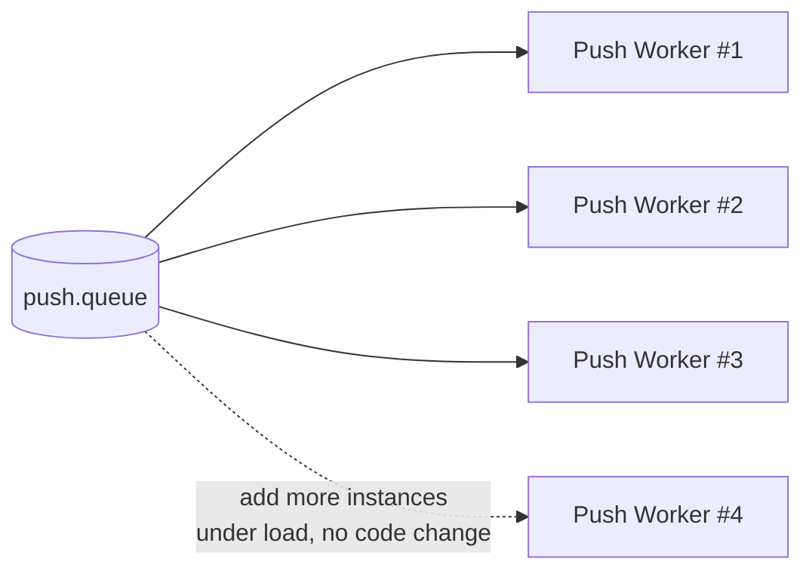
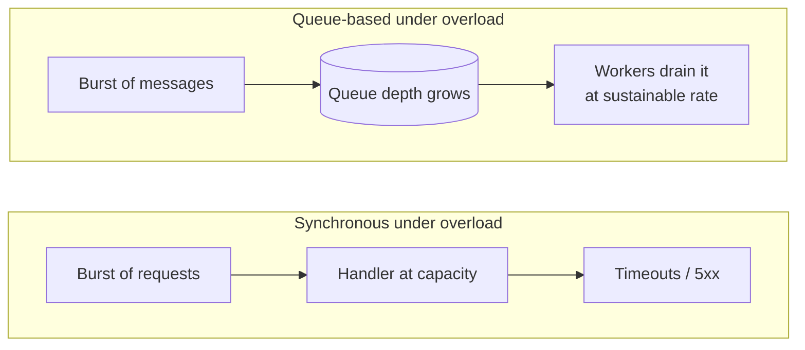
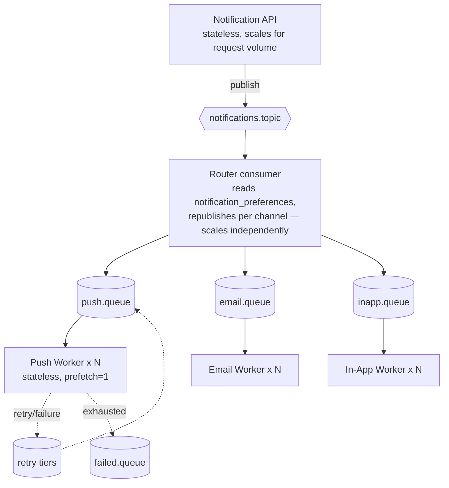

# 10 — Scalability

Everything up to this point has been about correctness: making sure a message is routed,
retried, and eventually either delivered or dead-lettered, exactly once in effect even though
the transport guarantees at-least-once. This phase asks a different question: **what happens
when volume goes up 10x or 100x, and how does this architecture absorb that without falling
over?**

## Horizontal scaling: why it "just works" here

Recall from 02-rabbitmq-fundamentals.md: a consumer sets `prefetch(1)`, meaning RabbitMQ will
only hand it one unacknowledged message at a time. Spin up five instances of the push worker,
each with `prefetch(1)`, and RabbitMQ distributes messages across whichever instance is
currently free — no coordination between the instances is required, and none of them need to
know the others exist.

This only works because of a design property established back in Phase 6 (workers &
consumers): **channel workers are stateless.** A push worker instance holds no in-memory state
about "which user I'm currently serving" or "what I processed five minutes ago" — every fact it
needs (the message payload, the delivery log row, the device token) comes from the message
itself or from Postgres. That statelessness is what makes horizontal scaling a non-event:

Contrast this with the naive synchronous design from Phase 1: scaling that meant scaling the
*entire* API process (DB connections, HTTP handling, and slow third-party calls all coupled
together). Here, scaling the push channel specifically means running more push-worker
instances — the API, the email workers, and the in-app workers are untouched. **Scaling is
per-component**, because the queue already decoupled the components from each other.

## Throughput vs. latency: the trade you're actually making

It's worth naming the trade explicitly, because it's easy to describe the async design as
strictly better without saying what it costs.

- **Synchronous system:** for any single request that succeeds, latency is as low as it can be
  — the client gets its answer the moment the last downstream call returns. But *sustainable
  throughput* is capped by the slowest, most rate-limited dependency in the chain, and past
  that cap the system doesn't degrade gracefully — it starts timing out and erroring, because
  there's nowhere for excess work to wait.
- **This project's async design:** every request pays a small latency tax — the message sits
  in a queue for some nonzero time, even under normal load, before a worker gets to it. In
  exchange, throughput is no longer bounded by the slowest downstream dependency, because the
  API's response no longer waits on that dependency at all. The system can absorb bursts far
  above its *processing* rate by letting the queue temporarily grow, then drain it as workers
  catch up — rather than rejecting or timing out the excess requests.

The honest framing for an interview or a design doc: **we deliberately pay a little latency
(message sits in a queue briefly) to buy a lot of throughput headroom and graceful degradation
under load.** For a "your order confirmation email arrives in 2 seconds instead of 200ms," that
trade is essentially free — nobody is watching a spinner for an email. It would be a bad trade
for something latency-sensitive on the *critical* path of a user-facing request (e.g. "is this
credit card valid" needs a synchronous answer, not a queued one).

## Backpressure: overload becomes a queue, not a failure

**Backpressure**, concretely in this system: if channel workers can't keep up with the rate
messages are being published, messages simply accumulate in the channel queue. Nothing times
out, nothing 500s, no request fails — the queue depth grows instead.

This is a genuine **feature**, not a side effect to tolerate. Compare it to what an overloaded
synchronous system does: incoming requests start timing out, users see errors, and the
overload itself often makes things worse (clients retry failed requests, adding *more* load to
an already-struggling system). An overloaded queue-based system instead just... has a backlog.
Once workers catch up — or you add more of them — the backlog drains and every message still
gets processed. No work is dropped; it's delayed.

### The real limit: backpressure isn't infinite

This doesn't mean queue depth can grow forever for free. RabbitMQ has to hold every
unconsumed message somewhere — in memory, and on disk for durable queues. If publish rate
permanently outpaces consumption rate (not a burst, but a sustained mismatch), queue depth
grows without bound, and eventually the broker itself comes under memory/disk pressure. At
that point RabbitMQ's own protective mechanisms kick in (e.g. publisher flow control, throttling
publishers to protect itself) — which means the backpressure that was "just a growing number in
a dashboard" becomes something that pushes back all the way to your API.

The practical fix is to treat **queue depth as an autoscaling signal**: monitor depth (and rate
of growth) per channel queue, and scale worker instance count up when depth crosses a
threshold, back down when it drains. This turns "the queue is growing" from a silent risk into
an automated response — exactly the metric that should also be feeding the alerting discussed
in 09-retries-and-dlq.md for `failed.queue`, just applied to the *live* channel queues instead
of the dead letter queue.

## Priority: should every notification wait its turn equally?

Not all notifications are equal. A transactional notification ("your payment failed," "your
OTP code") is time-sensitive and directly tied to something the user is actively waiting on
right now. A promotional notification ("50% off this weekend") has no such urgency — arriving
five minutes later costs nothing. If both share a queue FIFO-style, a burst of promotional
broadcast traffic (say, a `broadcast` admin call to every user) can sit a transactional message
behind thousands of promotional ones.

Two legitimate ways to fix this, with different trade-offs:

| Approach | How it works | Trade-off |
|---|---|---|
| **Separate high/low priority queues** (e.g. `push.queue.high`, `push.queue.low`) | Router publishes transactional-category messages to the high queue, promotional to the low queue; workers consume the high queue first (or with more consumers/weight) | Simple, inspectable, easy to reason about in the management UI; requires one more binding + queue per channel, and workers need explicit logic for "drain high before low" (e.g. two separate consumer loops, or consume high with higher prefetch/more instances) |
| **RabbitMQ native priority queues** | A single queue declared with `x-max-priority`, messages carry a `priority` property, RabbitMQ delivers higher-priority messages first within that one queue | Fewer queues to manage; but priority is only respected *among currently queued* messages — a long-held low-priority message already being processed won't be preempted, and very high max-priority values increase the broker's per-queue overhead |

This project's category field on `notifications` (and thus the routing key's `<category>`
segment, e.g. `notification.push.transactional` vs `notification.push.promotional`) already
carries exactly the information needed to make this decision at the router stage — so either
approach slots in without changing the exchange or routing key shape, only the binding/queue
setup on the channel side.

## Delayed / scheduled notifications

This is genuinely how the "scheduled notifications" item from the future-improvements list
would get built — worth sketching now since the mechanism is a direct extension of what's
already here.

**Option A — a delay queue per schedule granularity.** Extend the TTL + DLX pattern from
Phase 2/9, but instead of using it for retries, use it for *initial* delay: publish a message
into a `schedule.5min.queue` (TTL 5 minutes, no consumer), which dead-letters into the real
`notifications.topic` exchange once it expires. Coarse granularities (5 min, 1 hour, 1 day)
cover most "remind me in X" use cases cheaply, but exact-timestamp scheduling doesn't fit this
shape well — you'd need a TTL queue per unique delay, which doesn't scale.

**Option B — a dedicated scheduler service that polls due notifications.** A small service
with its own timer (e.g. every 30 seconds) queries a `scheduled_notifications`-style table for
rows whose `send_at <= now()` and haven't been published yet, publishes each one to
`notifications.topic` as a normal message, and marks it published. This is more moving parts
(a new poller process, a new table, a "did I already publish this" guard — the same idempotency
concern as everywhere else in this system) but handles arbitrary, exact timestamps naturally
and is trivial to reschedule or cancel before it fires (just update or delete the row).

For arbitrary user-specified send times ("remind me at 3:47pm next Tuesday"), Option B is the
realistic choice — it's what most production systems actually do. Option A is worth
understanding because it reuses infrastructure you already have, and is a reasonable fit if
your scheduling needs are coarse and fixed (e.g. "always retry digest emails at the top of the
next hour").

## High availability: the broker and the database aren't allowed to be single points of failure

Everything above assumes RabbitMQ and Postgres are always up. In reality, they're
infrastructure like anything else, and a design that routes every notification through *one*
broker instance and *one* database instance has just moved the single point of failure from
"the API server" (Phase 1's problem) to "the message broker" — not actually removed it.

- **RabbitMQ clustering + mirrored/quorum queues.** A single RabbitMQ node is one machine that
  can crash, need a restart, or run out of disk. Clustering runs multiple RabbitMQ nodes that
  share exchange/binding topology; **quorum queues** (the modern replacement for the older
  mirrored queues) replicate a queue's messages across multiple nodes using a Raft-based
  consensus protocol, so losing one node doesn't lose the queue's messages or availability.
  The practical implication for this project: `push.queue`, `retry.queue`, and `failed.queue`
  should all be quorum queues in a real deployment, not just durable queues on a single node —
  durability protects against *that node's* disk being written to, not against that node
  disappearing entirely.
- **Postgres read replicas / failover.** Read-heavy endpoints (`GET /notifications`,
  `GET /notifications/:id`) can be served from a read replica so they don't compete with
  writes (new notifications being inserted, delivery logs being updated) for the same
  connection pool. Failover (a standby getting promoted to primary if the primary dies) is what
  keeps writes possible at all if the primary instance fails — without it, a single Postgres
  crash takes down the entire notification pipeline, since every stage from "producer persists
  the notification" through "delivery log gets written" depends on it.

None of this needs to be running for the learning phases of this project — a single RabbitMQ
container and a single Postgres instance are correct for understanding the concepts. The point
of this section is knowing *what changes* between "this runs on my laptop" and "this is the
actual availability story for a system like Uber's," and why: single instances are fine until
the day that one instance is down, at which point the entire notification pipeline is down
with it, silently, for every user, not just a slow request here and there.

## Recap: the fan-out architecture, viewed through a scaling lens

Every box in this diagram scales independently and for a different reason: the API scales for
inbound request volume, the router scales for total event volume (it has to look at every
notification once, regardless of channel), and each channel worker scales for that channel's
specific delivery rate and provider rate limits (FCM's throughput ceiling has nothing to do
with email's). That independence — the direct payoff of Phase 1's original decoupling decision
— is the entire reason this architecture can absorb a 10x traffic increase by adding more
consumer instances to the specific stage that's actually falling behind, rather than needing to
scale everything uniformly.

## Checkpoint

1. Why does adding more push-worker instances "just work" without any coordination code
   between them? What two properties (from Phase 2 and Phase 6) does that depend on?
2. In your own words, what is the latency cost of the async design, and what do you get in
   return for paying it?
3. Why is a growing queue depth described as backpressure being a *feature*, but also something
   that needs a hard limit in practice?
4. If you had to add scheduled notifications tomorrow, which of the two approaches would you
   pick for "remind me in exactly 37 minutes," and which for "always send digest emails at
   9am"? Why might the answer differ?

## Common interview angle

"How would you scale this to handle 10x traffic?" is really asking whether you understand
*which* part of the system needs to scale, not just "add more servers." The strong answer
identifies the specific bottleneck stage (a slow channel, an overloaded router, a broker
running low on memory from queue depth) and proposes scaling that stage specifically — tied to
a concrete signal (queue depth, consumer lag) that would tell you it's the bottleneck in the
first place. "Just add more instances of everything" is the answer that sounds right but skips
the diagnostic step a real on-call engineer would actually do first.
