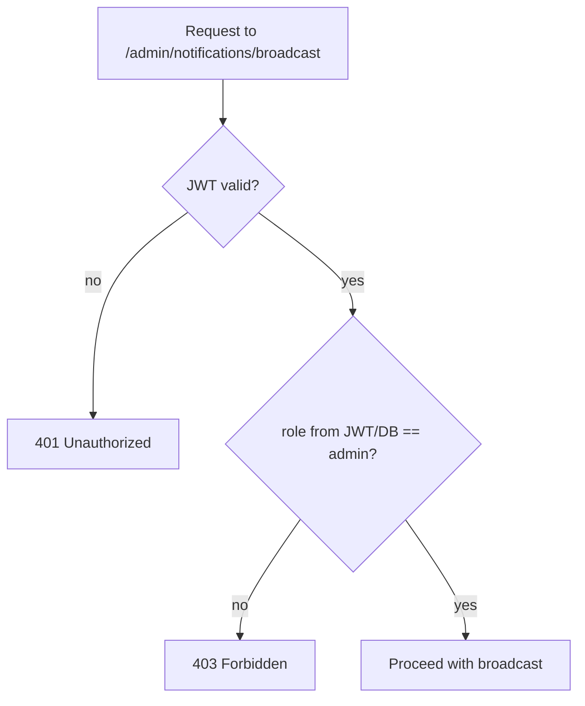

# 11 — Security

Everything so far has assumed a well-behaved client calling the API correctly. This phase
assumes the opposite: a client that is careless, malicious, or simply someone else's account
trying to do something it shouldn't. The point isn't to build enterprise-grade security theater
around a learning project — it's to understand *which* checks are load-bearing, and what
specifically breaks in this exact system if each one is missing.

A note on scope, upfront: **authentication in this project is deliberately minimal.** This is a
notification-system learning project, not an identity/auth-systems one — JWT-based auth exists
so there's a real `user_id` to attach notifications, tokens, and preferences to, not because
auth itself is the thing being studied here. That said, "minimal" doesn't mean "sloppy" — the
few auth decisions that do exist need to be the *right* few, which is what this phase covers.

## Authentication: JWT, and what it actually proves

`POST /auth/signup` and `POST /auth/login` are the only two unauthenticated endpoints in the
system. Login, on success, issues a JWT — a signed token containing (at minimum) the user's
`id` and `role`, which the client then sends as a bearer token on every subsequent request.

What a valid JWT proves: "the server issued this token to this specific user, and it hasn't
been tampered with since" (the signature check fails if any claim inside it — `id`, `role` —
has been altered). What it does **not** prove on its own: that the action the request is
attempting is one this user is *allowed* to take. That's a separate concern — authorization,
covered below — and conflating the two is one of the most common real-world security bugs.

## Password hashing: never store what you can't afford to leak in plaintext

`users.password_hash` is named `password_hash`, not `password`, deliberately: the raw password
is never stored, anywhere, in any form that could be reversed back into the original password.

- **Hash with bcrypt or argon2** (not a fast general-purpose hash like MD5 or SHA-256) at
  signup, and compare hashes at login — never compare plaintext passwords, and never decrypt
  anything, because there's nothing to decrypt. Bcrypt/argon2 are deliberately *slow* and
  salted per-password, which is exactly what you want here: if the `users` table ever leaks
  (a breach, a misconfigured backup, a careless log line), an attacker with a table of fast
  hashes can brute-force thousands of passwords per second; the same attack against
  bcrypt/argon2 hashes is orders of magnitude slower, per password, by design.
- **Never "encrypt" passwords** with a reversible cipher instead of hashing. Encryption implies
  a key that can decrypt it back to plaintext — which means anyone who compromises that key (or
  the code that holds it) recovers every user's actual password. Hashing has no such key; even
  the system that created the hash cannot turn it back into the original password. This
  distinction — hashing vs. encryption — is a very common thing to get asked to explain
  precisely, because "just encrypt it" is a natural-sounding but wrong instinct here.

## Authorization: `role = admin`, enforced server-side, every time

The three admin endpoints — `POST /admin/notifications/send`,
`POST /admin/notifications/send-bulk`, `POST /admin/notifications/broadcast` — are gated by a
guard that checks `role = 'admin'` on the authenticated user. The critical detail: **this check
must be derived from the JWT's signed `role` claim (or a fresh DB lookup by `user_id`), never
from anything the client sends in the request body or a header.**

Why this matters concretely: if the guard instead trusted a `role` field the client included
in the request payload (`{ "role": "admin", ... }`), any authenticated user — including a brand
new signup with zero privileges — could simply add that field to their request and call
`broadcast`. The signature on the JWT is what makes `role` trustworthy; a client-supplied field
with the same name has no such guarantee and is trivially forged.

This must be re-checked on **every single request**, not cached client-side or assumed from a
previous request in the same session. "The user logged in successfully" and "the user is
authorized for this specific action" are two different checks answering two different
questions, and a system that only performs the first is only checking identity, not
permission.

## Never trust a client-supplied `user_id`

`POST /device-tokens` registers an FCM token against a user. The request body naturally
contains the token and platform — but it must **never** accept or trust a client-supplied
`user_id` field, even if one is present in the payload. The `user_id` the token gets attached
to must always come from the authenticated request context (the JWT's `sub`/`id` claim),
resolved server-side, ignoring anything the body claims.

Concretely, what breaks if this rule is violated: any logged-in user could register a device
token against *another* user's `user_id` simply by putting that ID in the request body. Since
`device_tokens.user_id` is exactly what the push-sending path uses to decide whose phone
receives a notification, this would let an attacker redirect another user's notifications to
their own device — a real information-disclosure and account-confusion bug, not a theoretical
one. The same principle applies everywhere a record's ownership is being established: the
owner is *always* "whoever is making this authenticated request," derived server-side, never a
field the client is trusted to fill in honestly.

## Rate limiting: bulk-send endpoints are a force multiplier for abuse

`POST /admin/notifications/broadcast` and `POST /admin/notifications/send-bulk` are unusually
dangerous endpoints from an abuse standpoint, for a reason that's easy to underweight: **a
single successful call fans out into potentially thousands of downstream sends.** Most
endpoints in this system have a 1:1 relationship between "one malicious request" and "one unit
of damage." These endpoints have a 1:N relationship — one call, one bad actor, one moment of
insufficient rate limiting, and every user on the platform gets spammed simultaneously, FCM
quota gets burned, and (per Phase 9/10) the resulting message volume could itself overwhelm the
push queue.

Two independent layers of defense, not a substitute for each other:

1. **Authorization** (covered above) already restricts these endpoints to `role = admin`
   accounts — but that only helps if admin accounts themselves are hard to obtain/compromise,
   and it does nothing to stop a *legitimate* admin account from being used carelessly or
   compromised via a stolen token.
2. **Rate limiting** on top of that — capping how many broadcast/bulk-send calls a given admin
   account (or IP) can make per minute/hour — bounds the blast radius even if an admin token is
   compromised, or an internal tool has a bug that calls the endpoint in a loop. A compromised
   regular-user account can only ever spam that one user's own notification history; a
   compromised admin token with no rate limit can spam the entire user base in seconds.

The general principle: the higher the fan-out multiplier of an endpoint, the more layers of
defense it deserves, because a single mistake or single compromised credential there does
proportionally more damage than the same mistake on a low-fan-out endpoint.

## Input validation via DTOs: a security boundary, not just a correctness one

Every request body in this system should be validated against an explicit DTO (e.g. using
`class-validator` decorators in NestJS) before it touches any business logic. It's easy to think
of this purely as a correctness tool ("catch typos, wrong types, missing fields early"), but it
is equally a security boundary:

- Rejecting unexpected fields (e.g. a `role` or `user_id` field on a DTO that shouldn't accept
  one at all) is what makes the "never trust client-supplied user_id/role" rules above actually
  enforceable in practice, rather than relying on every handler remembering to manually strip
  them.
- Enforcing types and shapes (e.g. `category` must be one of the known enum values, `data` must
  be valid JSON of a bounded size) prevents malformed or oversized payloads from reaching the
  database, the queue, or a downstream provider like FCM, where the failure would otherwise
  surface much later and much less clearly (turning into a Phase 9 poison message instead of a
  clean 400 at the API boundary).
- Whitelisting instead of blacklisting fields (reject unknown properties outright, rather than
  trying to enumerate every "dangerous" field name) is the more robust version of the same idea
  — it doesn't depend on anticipating every field an attacker might try to smuggle in.

## Secrets management

Three categories of secret this system depends on, none of which should ever be committed to
source control or embedded in application code:

- **FCM service account JSON** — the credential that lets this backend authenticate to Firebase
  and actually send pushes. Anyone who obtains this file can send push notifications as this
  project's Firebase app, to any registered device token, without going through this system's
  auth at all.
- **Database credentials** — connection string/password for Postgres.
- **RabbitMQ credentials** — the broker connection's username/password (and, in production,
  TLS configuration).

All of these belong in environment variables or a dedicated secret store (e.g. a `.env` file
excluded via `.gitignore` locally, a real secrets manager in production), injected at runtime,
never hardcoded and never checked into git history. A secret that was committed and later
removed from the latest commit is **still compromised** — it exists in git history and must be
rotated, not just deleted from the current file.

## Common mistakes

| Mistake | Why it's a problem here specifically |
|---|---|
| Exposing internal infrastructure details in API error responses | An error message that leaks `"failed to publish to notifications.topic"` or a raw Postgres constraint name hands an attacker a map of your internals — exchange names, queue names, table/column names — none of which a client needs to see to understand "something went wrong, try again" |
| Trusting any client-supplied identifier (`user_id`, `role`, `notification_id` ownership) | Every one of these must be either derived from the authenticated request context or checked against ownership server-side (e.g. `GET /notifications/:id` must verify the notification's `user_id` matches the requester before returning it — not just that *a* notification with that id exists) |
| Conflating "logged in" with "authorized for this action" | A valid JWT proves identity, not permission; every admin/ownership-sensitive endpoint needs its own explicit authorization check, re-evaluated per request, not inferred from the mere presence of a valid token |
| Skipping rate limiting on high-fan-out endpoints because "only admins can call it" | Authorization and rate limiting defend against different threats (an unauthorized caller vs. a compromised/careless authorized one) — relying on only one leaves the other gap fully open |

## Checkpoint

1. Why is it wrong to say a valid JWT proves a request is "authorized" — what's the precise gap
   between authentication and authorization?
2. If `POST /device-tokens` trusted a client-supplied `user_id`, walk through the exact abuse
   this would enable given how `device_tokens.user_id` is used later in the push-sending path.
3. Why do bulk-send/broadcast endpoints need rate limiting *in addition to* the admin-role
   guard, rather than treating the guard as sufficient on its own?
4. Give a concrete example of information an API error response should never include in this
   system, and explain what an attacker gains from seeing it.

## Common interview angle

"What's the difference between authentication and authorization?" sounds like a definitions
question but is really testing whether you can point to a concrete bug that results from
confusing them — e.g. an endpoint that checks "is there a valid token" but never checks "does
this specific token's owner have permission for this specific action or this specific
resource." The strongest answers ground it in an example like this project's admin guard or the
`device_tokens` ownership check, not just the textbook definitions of the two terms.
