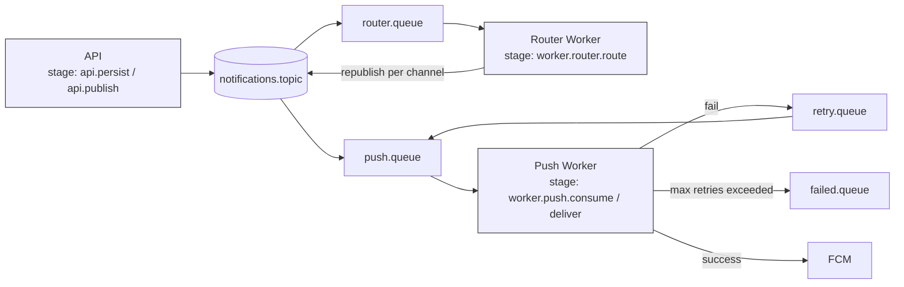

# 12 — Monitoring: How Do You Know It's Actually Working?

Every phase up to this point has been about making the system *do* the right thing: publish
reliably, route correctly, retry on failure, dead-letter poison messages. This phase is about a
different question — once it's running, unattended, how do you *know* any of that is still
true? A synchronous system tells you it's broken the moment a request fails: the client gets a
500, right now, in front of a human. An asynchronous system has no such reflex. A worker can be
crash-looping for an hour, silently failing to deliver every push notification, and the API will
keep returning 201 the entire time — because from the API's point of view, the message was
published successfully. The failure is invisible unless you deliberately go looking for it.

## Why "it returned 201" is not the same as "it worked"

Recall from Phase 1: the API's contract is *validate, persist, publish, respond* — it does not
wait to find out whether the notification was actually delivered. That's the entire point of the
async split. But it means **success at the API layer and success at the delivery layer are two
different facts, observed at two different times, by two different parts of the system.**
Monitoring is how you close that gap — how you answer "of the 10,000 notifications queued in the
last hour, how many actually reached a device?" without that question ever touching the request/
response cycle.

Without monitoring, this system degrades in the worst possible way: **silently.** Nobody gets
paged when a queue backs up — users just stop getting notifications, and you find out from a
support ticket days later, with no way to tell how long it's been broken or how many messages
were affected.

## Structured logging: correlate by `notification_id`

A single notification's life touches at least four separate processes: the API (persists +
publishes), the exchange/queue (routes, possibly retries), the channel worker (consumes,
delivers), and potentially the retry cycle (nack → `retry.queue` → back to the channel queue).
Each of those runs in a different container, at a different time, with its own log stream. If
each layer logs in its own format with no shared identifier, debugging "why didn't user X get
notification Y" means manually cross-referencing timestamps across four different log tails —
which does not scale past the second time you have to do it.

The fix is the same one every distributed system uses: **every log line touching a given
notification includes its `notification_id`** (the primary key of the `notifications` row,
generated at persist time, before publish). Every layer logs it in a structured (JSON) format so
it's greppable/queryable, not just human-readable prose:

```json
{"level":"info","notification_id":"9f2e...","stage":"api.persist","msg":"notification row created","userId":"u_123"}
{"level":"info","notification_id":"9f2e...","stage":"api.publish","msg":"published","routingKey":"notification.push.transactional"}
{"level":"info","notification_id":"9f2e...","stage":"worker.push.consume","msg":"message received","attempt":1}
{"level":"error","notification_id":"9f2e...","stage":"worker.push.deliver","msg":"FCM send failed","error":"messaging/registration-token-not-registered"}
{"level":"info","notification_id":"9f2e...","stage":"worker.push.retry","msg":"nack, routed to retry.queue","retryCount":1}
{"level":"info","notification_id":"9f2e...","stage":"worker.push.deliver","msg":"delivered","attempt":2}
```

With this, "trace one notification's full journey" becomes a single query: `grep notification_id
9f2e... across all container logs` (or, in production, a log aggregator query filtered on that
field) — and the output *is* a timeline, in order, across every process it passed through,
without needing to know which container or timestamp to look at first. This is the same idea as
a **trace ID** in HTTP request tracing (e.g. `X-Request-Id`); we're just applying it to a message
instead of a request, because a message, unlike a request, doesn't stay in one process for its
whole lifetime.



Every box in that diagram logs the same `notification_id` — that's what turns four disconnected
processes into one traceable story.

## Key metrics: what to actually watch

Logs answer "what happened to *this one* notification." Metrics answer "is the *system as a
whole* healthy right now" — and they need to be checked before something goes wrong, not just
grepped after.

| Metric | Why it matters | What a bad value looks like |
|---|---|---|
| **Queue depth per queue** | The single most important early-warning signal in this whole system. It directly answers "are consumers keeping up with producers?" | Depth climbing steadily instead of hovering near zero — messages are arriving faster than they're being consumed, or consumers have stopped entirely |
| **Consumer count per queue** | A queue can only drain if something is actually subscribed to it. This catches "all push workers crashed" *before* depth even has time to build up | Consumer count drops to 0 while the queue is still receiving messages |
| **Delivery success/failure rate per channel** | Queue depth tells you messages are *moving*; this tells you whether they're *succeeding* once a worker picks them up | Failure rate for `push.queue` spikes — e.g. FCM credentials expired, or a large batch of device tokens went stale at once |
| **`failed.queue` size** | This queue should be at (or extremely close to) zero at all times — by design, only messages that exhausted all retries land here | Any sustained non-zero value; growth over time means the retry/DLQ safety net is actively catching messages nobody is looking at |

Queue depth deserves the "single most important" label specifically because it's a **leading**
indicator — it rises *before* users notice anything is wrong, while delivery failure rate is
often a **lagging** one (you only see failures after a worker has already tried and failed). If
you can only watch one number on a dashboard while doing something else, watch queue depth.

## Start with the tool you already have: the RabbitMQ Management UI

Phase 2 already had you open `http://localhost:15672` to create exchanges and queues by hand.
That same UI is, without installing anything else, a real monitoring tool:

- The **Overview** page shows global message rates (publish/deliver/ack per second) across the
  whole broker.
- The **Queues** page lists every queue with live **depth** (ready + unacked message counts),
  **consumer count**, and a per-queue message-rate sparkline — exactly the first two metrics from
  the table above, with zero extra setup.
- Clicking into a queue shows **"Get messages"**, which lets you peek at (or requeue) actual
  message bodies sitting in `failed.queue` — this is your first, most direct way to answer "what
  exactly is in the dead letter queue right now?"

For a project at this stage, checking this page periodically (or refreshing it while running a
manual test) is a perfectly legitimate monitoring strategy. It doesn't scale to "page someone at
3am automatically," but it's honest, immediate ground truth about the state of every queue in the
system, and it's the right first tool before reaching for anything heavier.

**The later upgrade path**, worth knowing about but *not* implemented here: RabbitMQ ships a
`rabbitmq_prometheus` plugin that exposes all of these same metrics (queue depth, consumer count,
message rates) as a scrape endpoint, which Prometheus polls on an interval and Grafana turns into
dashboards and alert rules. The concepts don't change — you're watching the exact same numbers —
what changes is *automation*: instead of you opening a browser tab, a rule fires and pages
someone the moment `failed.queue` depth crosses zero. That's a natural next step once this
project needs to run unattended for real; it is not needed to *understand* what to monitor.

## Why `queue_logs` matters after the fact

The Management UI and Prometheus both show you the **current state** of a queue — depth right
now, consumers right now. Neither answers "what happened to a message that already left the
queue two hours ago?" once it's no longer sitting there. That's what the `queue_logs` table
(from the DB schema, Phase 4) is for: a durable, queryable **history** of queue-level events —
published, consumed, acked, nacked, retried, dead-lettered — each row tied back to a
`notification_id` and a timestamp.

This matters because RabbitMQ itself is not a system of record. Once a message is ack'd and
deleted from a queue, RabbitMQ has no memory that it ever existed. If a user reports "I never got
notification X" and by the time you investigate the message has long since been processed one
way or another, the *live* queue state can't help you — but a `SELECT * FROM queue_logs WHERE
notification_id = ...` can, because it's a permanent record written at the time each event
happened, not a live view of the broker. In effect: the Management UI/Prometheus tell you what's
happening **now**; `queue_logs` (together with `notification_delivery_logs`) tells you what
happened **then**.

## Alerting thresholds

A metric you never check is not monitoring — it's just data sitting somewhere. The point of
tracking the numbers above is to define, in advance, what value means "a human needs to look at
this":

| Condition | Why this threshold | What it usually means |
|---|---|---|
| `failed.queue` depth > 0, sustained for any meaningful window | By design this queue should be empty; even one message means the retry safety net gave up on something | A genuinely bad message (poison message) or a real, persistent downstream failure (e.g. FCM rejecting every token) |
| A channel queue's depth grows continuously for N minutes (e.g. 5) | A momentary spike is normal (burst of traffic); *continuous, sustained* growth means consumption rate is permanently below arrival rate | Workers crashed, are too slow, or need to be scaled up (Phase 9/13 scaling story) |
| Consumer count for a queue drops to 0 while depth > 0 | Nothing is even attempting to drain the queue | All worker instances for that channel are down/crashed |
| Delivery failure rate for a channel exceeds some baseline (e.g. >5% over 15 min) | Occasional individual failures (a stale token) are expected and handled by retry/DLQ; a *rate* spike points at a systemic cause, not one-off bad data | Expired FCM service account credentials, a provider outage, or a bug shipped in the last worker deploy |

These thresholds are deliberately about **trends**, not single data points — one message briefly
in `retry.queue`, or one momentary depth blip, is the system working exactly as designed (Phase
7). It's *sustained* deviation from the expected near-zero baseline that should wake someone up.

## Checkpoint

1. Why can a request to the API succeed (return 201) while the actual notification delivery
   silently fails? What does that imply about where you have to look to catch delivery problems?
2. Why is queue depth called a "leading" indicator and delivery failure rate a "lagging" one —
   and why does that difference matter for which one you'd want on a dashboard you glance at
   occasionally?
3. RabbitMQ's Management UI can show you a queue's current depth, but not "what happened to
   message X three hours ago." What in this system's design fills that gap, and why can't the
   broker itself do it?
4. Why should an alert fire on `failed.queue` depth > 0 rather than, say, depth > 100? What's
   different about that queue compared to the channel queues?

## Common interview angle

"How would you monitor a queue-based system in production?" is really testing whether you know
that **queue depth is the primary signal**, not an afterthought — many candidates jump straight
to "error rate" or "uptime," which are lagging indicators that only reflect problems that have
already caused damage. The stronger answer leads with queue depth and consumer count as the
earliest, cheapest signals of trouble, and explains *why* they precede failure metrics rather than
just listing them alongside each other.
