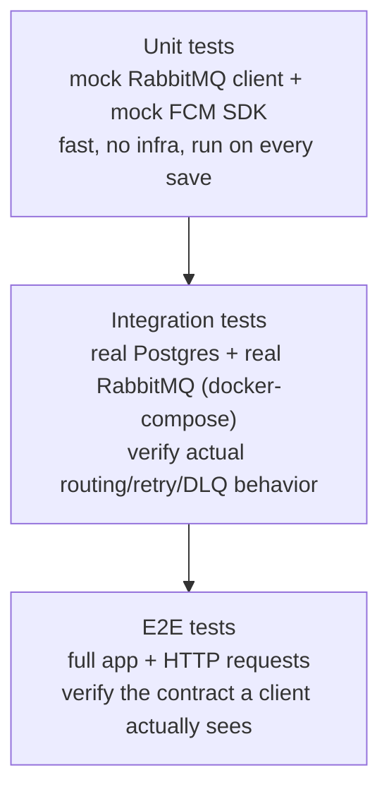

# 13 — Testing: How Do You Trust an Asynchronous System?

Testing a normal CRUD endpoint is mostly: call a function, assert the return value, maybe check
a row got written. This system has three properties a plain CRUD app doesn't, and each one
needs its own testing strategy: **it depends on infrastructure it doesn't own** (RabbitMQ, FCM),
**it must tolerate duplicate delivery** (Phase 2's at-least-once guarantee), and **it has
time-based behavior** (retry TTLs, exponential backoff). A test suite that only calls services
directly and asserts return values will miss all three — and those three are exactly where the
real bugs in a system like this live.

## The shape of the test pyramid here



Each layer exists because the layer below it *can't* prove what it proves:
- A unit test can prove "my service calls `channel.publish` with the right routing key." It
  cannot prove that a topic exchange bound the way we configured actually routes that key to
  `push.queue` — that's a fact about RabbitMQ's configuration, not our code.
- An integration test can prove routing, retry, and DLQ behavior against a real broker. It
  cannot prove that a client hitting `POST /admin/notifications/send` over HTTP gets a 201 and a
  correctly-shaped body — that requires the whole app wired together.

## Unit tests: mock the infrastructure, test the logic

The services we write (`NotificationsService`, each channel worker's message handler) contain
*decisions* — should this be sent, has it already been sent, what payload does FCM need — wrapped
around calls to two things we don't control: the RabbitMQ client and the FCM SDK. Unit tests
should never touch either for real:

- **Mock the RabbitMQ client** (e.g. NestJS's `ClientProxy`, or whatever thin wrapper sits around
  `amqplib`) so a test can assert "`.emit()` was called once, with this routing key and this
  payload" without a broker running at all.
- **Mock the FCM SDK** (`admin.messaging().send(...)`) so a test can assert "the push worker
  called FCM with this device token and this payload" — or, just as importantly, "the push
  worker did *not* call FCM" for the idempotency case below — without any real device or Firebase
  project involved.

```
describe('NotificationsService.dispatch', () => {
  it('persists a notification row and publishes with the correct routing key', async () => {
    const publishSpy = jest.fn();
    const service = new NotificationsService(mockRepo, { emit: publishSpy });

    await service.dispatch(['user_1'], { title: 'Hi', category: 'transactional' });

    expect(mockRepo.save).toHaveBeenCalled();
    expect(publishSpy).toHaveBeenCalledWith(
      'notification.push.transactional',
      expect.objectContaining({ notificationId: expect.any(String) }),
    );
  });
});
```

These tests are fast (milliseconds, no network, no Docker), run on every save, and pin down the
*decision logic* — which is exactly the part that's actually ours to get wrong. They deliberately
say nothing about whether RabbitMQ or FCM will behave as expected; that's the next layer's job.

## Integration tests: prove the infrastructure is wired correctly

Mocking the RabbitMQ client verifies our code *calls* publish correctly. It cannot verify the
**bindings** — the actual routing configuration from Phase 2 — actually deliver a message with
routing key `notification.push.transactional` into `push.queue`, or that a message expiring out
of `retry.queue` really does land back in the channel queue via the DLX. That configuration lives
in RabbitMQ itself, not in application code, so it can only be verified against a *real* broker.

The standard approach: a **test-specific `docker-compose.yml`** (or a dedicated CI job) that
brings up real Postgres and real RabbitMQ containers, runs migrations, declares the actual
exchange/queue/binding topology, and then runs a test suite against them over the real network
protocol — no mocks at this layer at all:

```yaml
# docker-compose.test.yml (illustrative)
services:
  postgres-test:
    image: postgres:16
    environment:
      POSTGRES_DB: notifications_test
  rabbitmq-test:
    image: rabbitmq:3-management
```

A representative integration test: publish a message with routing key
`notification.push.transactional` directly to `notifications.topic`, then assert it can be
consumed from `push.queue` — proving the exchange/binding topology, not just application code,
behaves as designed.

## Testing idempotency: the same message delivered twice

Phase 2 established that RabbitMQ guarantees **at-least-once** delivery, never exactly-once — a
worker that finishes delivering a push but crashes before it acks will see that same message
redelivered. If the worker just calls FCM again on redelivery, the user gets a duplicate push.
The fix (Phase 6) is checking `notification_delivery_logs` for an existing successful delivery
row for that `notification_id` + channel *before* calling FCM at all.

Testing this doesn't require actually crashing a worker mid-processing — it requires simulating
*the same message arriving twice* and asserting the side effect (the FCM call) happens exactly
once:

```
it('does not call FCM twice for a message delivered twice', async () => {
  const fcmSendSpy = jest.fn();
  const worker = new PushWorker(mockFcm(fcmSendSpy), realDeliveryLogRepo);

  const message = { notificationId: 'n_1', deviceToken: 'tok_abc' };
  await worker.handle(message); // first delivery
  await worker.handle(message); // simulated redelivery of the *same* message

  expect(fcmSendSpy).toHaveBeenCalledTimes(1);
});
```

The assertion that matters is `toHaveBeenCalledTimes(1)`, not `toHaveBeenCalled()` — the whole
point of this test is proving the *second* call was short-circuited by the delivery-log check,
which is precisely the mandatory-idempotency requirement Phase 2 introduced.

## Testing the retry/DLQ path: without waiting for real TTLs

The retry pattern from Phase 2/7 (nack → `retry.queue` with a TTL → dead-lettered back to the
channel queue → retried, capped by a retry-count header, terminal failures landing in
`failed.queue`) is inherently time-based — in production, TTLs might be 30s, 2min, 10min. A test
suite that actually waits 10 minutes for a real TTL to expire is both slow and flaky (nobody lets
CI run for 15 minutes to prove one retry cycle).

The fix: a **test-specific queue topology with short TTLs** — e.g. `retry.queue` configured with
a 200ms TTL instead of 30s, declared only in the test environment's RabbitMQ config, with the
exact same DLX/routing-key wiring as production. The *logic* under test (retry count header
incrementing, terminal dead-lettering after max attempts) is identical; only the timing constant
changes, and only for tests.

```
it('routes a message to failed.queue after exceeding max retries', async () => {
  let attempts = 0;
  const alwaysFailingHandler = jest.fn(() => { attempts++; throw new Error('boom'); });
  const worker = new PushWorker(alwaysFailingHandler, { maxRetries: 5 });

  await publishTestMessage('notification.push.transactional', { notificationId: 'n_2' });
  await waitForQueueToSettle('failed.queue'); // polls briefly; TTLs are ~200ms in test config

  expect(attempts).toBe(6); // 1 initial attempt + 5 retries
  const failed = await getMessagesFrom('failed.queue');
  expect(failed).toHaveLength(1);
  expect(failed[0].properties.headers['x-retry-count']).toBe(5);
});
```

This proves the *cap* actually terminates the loop (a poison message doesn't retry forever) and
that it terminates in the *right place* (`failed.queue`, not silently dropped) — without the test
run taking anywhere near as long as production retry delays would.

## E2E tests: the contract a real client sees

Unit and integration tests both verify internals. E2E tests verify the thing Phase 5 (API
design) actually promises a client: hit a real HTTP endpoint, get a real response, and confirm
the *observable* side effects actually happened — a row in the database, and a message actually
published.

```
it('POST /admin/notifications/send persists a row and publishes a message', async () => {
  const app = await createTestApp(); // real Nest app, real Postgres, test double or real broker
  const res = await request(app.getHttpServer())
    .post('/admin/notifications/send')
    .set('Authorization', `Bearer ${adminToken}`)
    .send({ userId: 'user_1', title: 'Hi', category: 'transactional' });

  expect(res.status).toBe(201);

  const row = await notificationsRepo.findOne({ where: { userId: 'user_1' } });
  expect(row).toBeDefined();

  const published = await getMessagesFrom('push.queue'); // real broker, or recorded by a test double
  expect(published).toHaveLength(1);
});
```

There's a real choice here on the "was a message published" assertion:

| Approach | What it proves | Cost |
|---|---|---|
| Real broker, inspect the actual queue | The entire path — routing key, binding, exchange config — really works end to end | Slower, needs RabbitMQ running for e2e, closer to the integration layer above |
| Test double (a fake `ClientProxy` that just records `.emit()` calls) | The API layer *attempted* to publish the right thing | Fast, no broker dependency, but doesn't prove the routing config itself is correct |

Both are legitimate — the test double is fine for e2e specifically *because* the integration
tests already cover real broker routing separately. Using a test double here isn't cutting a
corner; it's avoiding re-proving, at the slowest layer of the pyramid, something the middle layer
already proves cheaper and faster.

## Where each test type lives in this project

| Layer | What it mocks | What it proves | Example |
|---|---|---|---|
| Unit | RabbitMQ client, FCM SDK | Service/worker decision logic | "publish is called with the right routing key" |
| Integration | Nothing (real Postgres + RabbitMQ) | Actual exchange/binding/retry/DLQ config works | "a message with this routing key really lands in `push.queue`" |
| E2E | Optionally the broker (test double) | The full HTTP contract from Phase 5 | "`POST /admin/notifications/send` returns 201 and a row exists" |

## Checkpoint

1. Why can't a unit test that mocks the RabbitMQ client ever prove that a topic binding routes a
   message to the right queue? What layer of test *can* prove that?
2. In the idempotency test, why is the meaningful assertion "called exactly once" rather than
   "was called"? What bug would a weaker assertion fail to catch?
3. Why does testing the retry/DLQ path use a shortened TTL instead of mocking time entirely (e.g.
   fake timers)? What would you lose by mocking the RabbitMQ-side TTL mechanism away completely?
4. When would you choose a real broker over a test double for asserting "a message was
   published" in an e2e test, and when is the test double the better call?

## Common interview angle

"How do you test a system built around a message queue?" is checking whether you understand that
mocking the queue everywhere is a trap — it makes tests fast but blind to the exact class of bugs
that matter most in this kind of system: misconfigured bindings, broken retry loops, and
duplicate-delivery bugs. The strong answer names the layered strategy above and explains *why*
each layer exists (what the layer below it structurally cannot prove), rather than just listing
"unit, integration, e2e" as three boxes to check.
