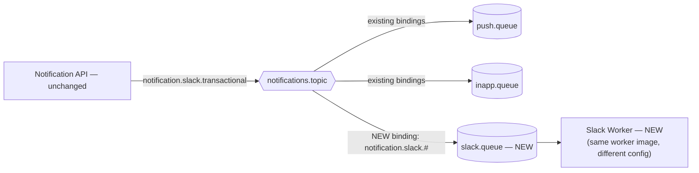

# 15 — Future Improvements & Recap: What We Deferred, and What You Now Understand

Every phase so far has been about building the *core* shape of a notification system: the async
split, the broker, the schema, the API, the workers, delivery to a real device, retries, and how
to observe/test/ship the whole thing. None of that is "done" in the sense of "nothing more could
ever be added" — it's done in the sense of "the foundation is solid enough that everything below
is an *extension*, not a redesign." This closing phase is about naming what was deliberately left
out, why leaving it out was the right call for a learning project, and what it would actually
take to build each one for real.

## What was intentionally deferred, and why

### Scheduled notifications

Everything built so far assumes a notification is sent **now**, the moment the API publishes it.
A real product needs "remind this user in 3 days" or "send this promotion at 9am in the user's
timezone" — which means a message that shouldn't be delivered to a worker until some future time,
not immediately.

This isn't something the current topic exchange can do on its own — a queue with a consumer
attached delivers a message as soon as it arrives, there's no native "hold this until time T."
What it needs is a **delay/scheduling mechanism**: either a per-notification TTL + dead-letter
pattern conceptually similar to the retry queue from Phase 2/7 (but sized to the actual delay
requested, not a fixed short retry interval), or a proper delayed-message plugin/scheduler service
that polls "what's due now" and publishes at the right moment. This is exactly the kind of
mechanism discussed in `10-scalability.md` — scheduling at scale (millions of pending scheduled
notifications) is a distinct scaling problem from delivering messages that are already ready to
send, which is why it's called out separately rather than folded into the retry queue we already
have.

### Bulk notifications, done properly

`POST /admin/notifications/send-bulk` (Phase 5/12) already accepts an array of user IDs and
dispatches to each — that's a real start, not a stub. But it assumes the array is small enough to
handle in one request/transaction. A *true* bulk system — sending to hundreds of thousands or
millions of users — needs:
- **Batching**: chunking the target list so no single operation tries to persist and publish a
  million rows in one transaction.
- **Backpressure handling**: if publishing a million messages instantly would flood the channel
  queues faster than workers can ever drain them (directly triggering the "queue depth grows
  continuously" alert from Phase 12), the bulk sender needs to pace itself against the queue's
  actual drain rate, not blindly publish as fast as the DB can insert rows.

The current endpoint proves the *shape* of bulk sending is right (one service method, resolved
`userIds[]`, same dispatch path as `send`/`broadcast`); it doesn't yet prove it survives the list
being 100x larger than what fits comfortably in one request.

### Notification templates, made real

The `notification_templates` table already exists in the schema (Phase 4) as a placeholder — a
row with a name and some body text — but "a table with text in it" is not yet a templating
system. What's missing to make it real:
- **Variable interpolation**: a template body like `"Hi {{name}}, your order {{orderId}} shipped"`
  needs an actual rendering step at send time, substituting real values from the notification
  payload — currently every send just passes a fully-formed `title`/`body` directly, bypassing
  templates entirely.
- **Versioning**: if a template's wording changes after notifications referencing it have already
  been sent, old notifications should still render (or at least be inspectable) as the version
  that was active *when they were sent* — not silently reflect today's edited copy. Without
  versioning, editing a template retroactively rewrites history for every notification that ever
  used it, which breaks any audit/compliance story ("what did we actually tell this user on this
  date?").

### Campaigns

Right now, every `send`/`send-bulk`/`broadcast` call is independent — there's no concept linking
"these 50,000 sends were all part of the same promotional push" into one trackable entity. A
campaigns feature would add a `campaigns` row that many `notifications` rows reference, plus
**aggregate delivery stats** rolled up from `notification_delivery_logs` per campaign (sent,
delivered, failed, read — across every recipient) rather than only per individual notification.
This is a natural extension of the existing delivery-log design (Phase 10), not a new logging
mechanism — it's a grouping and aggregation layer on top of data we already capture.

### Additional channels: email, SMS, WhatsApp, Slack, Discord, Teams

This is worth restating precisely, because it's the clearest payoff of the architecture decisions
made all the way back in Phase 2: adding a new delivery channel to this system costs **one new
queue, one new binding, and one new worker — and zero changes to the publisher.** The API
persists a `notifications` row and publishes a message with routing key
`notification.<channel>.<category>` exactly as it does today; it has never known or cared how
many channels exist. Adding, say, Slack means: create `slack.queue`, bind it to
`notifications.topic` with pattern `notification.slack.#`, and stand up one more worker (using the
same "one worker image, parameterized" pattern from Phase 14) that consumes it and calls the Slack
API instead of FCM. Nothing in the API, the DTOs, the auth, or the admin endpoints changes at all.
This is precisely why topic (over direct) was chosen as the exchange type in Phase 2 — the whole
point of that decision was making this exact extension free.

## What you now understand

Stepping back across all fifteen phases: you started from a single, uncomfortable observation —
that calling FCM, an email provider, and an SMS provider directly inside an HTTP handler couples
your API's availability to three services you don't control (Phase 1) — and every phase since has
been the systematic, first-principles answer to that one problem. RabbitMQ (Phase 2) gave you the
vocabulary and the actual mechanism — exchanges, bindings, acknowledgement, prefetch — for
decoupling "something happened" from "something got delivered." The database schema (Phase 4) and
API design (Phase 5) gave that mechanism a durable, well-defined front door: a request becomes a
row, becomes a published message, without the client ever waiting on delivery. Workers and
consumers (Phase 6) turned messages into real side effects, safely, and FCM integration (Phase 8)
proved the whole pipeline against a real external system rather than a toy stand-in. Retries and
dead letter queues (Phase 7) made failure a designed-for outcome instead of a surprise, and
preferences/routing (Phase 9) proved that one event can fan out to many channels without the
publisher needing to know which ones are enabled for whom. Scalability (Phase 10/13) forced you to
reason about what happens under load rather than just under a single test message, and security
(Phase 14) forced you to reason about who could abuse each piece of what you'd built. Monitoring
(Phase 12) and testing (Phase 13) are the two disciplines that let you trust an asynchronous
system you can't watch synchronously — one tells you it's healthy *right now*, the other tells you
it will keep behaving correctly *after the next change*. And deployment (Phase 14) turned all of
that from "code that runs on my machine" into a system with an explicit, ordered, reproducible
startup story. None of these are separate lessons that happen to live in one repository — they're
one continuous answer, elaborated one primitive at a time, to the single question Phase 1 opened
with: what do you do with work that's too slow, too unreliable, or too external to do inline?

## Checkpoint (capstone)

1. Pick any one deferred feature above (scheduling, bulk, templates, campaigns, a new channel) and
   explain, from the existing architecture alone, exactly which pieces you'd add and which you
   would *not* need to touch. If your answer requires changing the publisher or the exchange
   topology, reconsider — that's usually a sign the design would need rework, not just extension.
2. Explain, without looking back at Phase 1, why the API returning 201 was never supposed to mean
   "the notification was delivered." What would have to change about this entire architecture if
   that were the guarantee we needed instead?
3. If you had to explain this whole system to someone in three sentences — not fifteen phases,
   three sentences — what would you say, and which phase's concept would you cut first if forced
   to shorten further? What does that tell you about which ideas are truly load-bearing?
